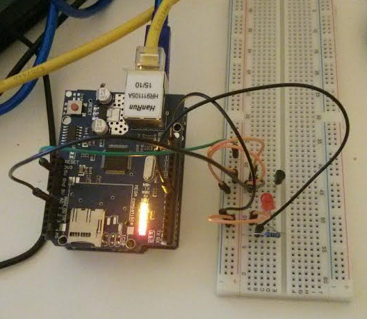

Writing a deepstream client only requires a TCP connection, basic string manipulation and a bit of JSON parsing. This means it can run on any hardware platform with any programming language. And to prove it I’m going to attempt to get it working on an Arduino uno!

What we will be covering in this blog entry is building a basic client with the ability to login and recieve/publish events. The same process can then be applied to achieve the full set of functionality including records, RPCs and webRTC.

Let's first set the requirements:

* Arduino can setup a TCP connection
* Arduino can authenticate
* Arduino can recieve events telling it to switch the LED on or off
* Arduino can listen if any clients are subscribed to temperature events
* Arduino can send out the temperature whenever it changes
* Bonus: Setup another client to recieve/send events

# The board

You'll need the following components:
* A W5100 [ethernet shield](//www.Arduino.cc/en/Main/ArduinoBoardEthernet)
* An Arduino [uno](//www.Arduino.cc/en/Main/ArduinoBoardUno)
* A red LED
* A temperature sensor

You can easily use different communication components such as [WiFi](//www.Arduino.cc/en/Guide/ArduinoWiFiShield101) or [bridge](//www.Arduino.cc/en/Reference/YunClientConstructor), but make sure to use their associated libraries instead.

Wiring it all together the board ended up looking like this:



Forgive me for not using the correct color cables, I ran out of a few
in a soldering accident =(

Now for the fun part!

# Connecting 

The first thing we need to do is to be able to get the Arduino board to connect to deepstream. Since I'm using a W5100 [ethernet shield](//www.Arduino.cc/en/Main/ArduinoBoardEthernet) all I have to do is include the library and call `ethernet.begin( mac )` inside of the setup. 

```clike
log("Getting IP...");
//Each shield has a different IP, you can find them on a sticker
//on new ones on the back
Ethernet.begin( mac );
//Print the IP you got. If it is 0.0.0.0 it means you didn't
//get an IP assigned and you would need to reset your board
log( Ethernet.localIP() );
```

Once I get my IP I can try connecting to deepstream! 

```clike
String state = "AWAITING_AUTHENTICATION";
const IP deepstreamHost = {192,168,0,201};
const int deepstreamPort = 6021;

log("Connecting...");

if (client.connect( deepstreamHost, deepstreamPort )) {
    log("Connected!");
} else {
    log("Connection faiLED");
}
```

Note: I initialised [the connection state](../../docs/connection_states.html) with AWAITING_AUTHENTICATION. This can also be initialised with CLOSE and then changed to AWAITING_AUTHENTICATION once a connection is successfully opened.

# Constructing Messages

I wrote a bunch of generic utility methods to make it easier for me to create deepstream messages for this example. Take a look at [how](../../info/messagestructure/) messages are [structured](../../info/messagestructure/specs.html) for more details.

```clike
String part = String( char( 31 ));
String split = String( char( 30 ));

String createMessage( String type, String action ) {
    return String( type + part + action + split );
}

String createMessage( String type, String action, String data1 ) {
    return String( type + part + action + part + data1 + split );
}

String createMessage( String type, String action, String data1, String data2 ) {
    return String( type + part + action + part + data1 + part + data2 + split );
}
```

As you can see all the utility methods do are take parameters and concatenate them with the correct message part and end characters. It certainly isn't the most efficient manner of concatenating strings' but its simplicity is great for this example.

# Logging In 

Now that we have a connected client and a bunch of utility methods, lets start looking into getting logged in!

The first thing we need to do is to send our credentials. Once we are in the  AWAITING_AUTHENTICATING state we are ready to send the login details. We will login using the Arduino ID to ensure it has permissions to actually trigger and subscribe to events. All that's needed is to pass in the ID via the [login message](../../info/messagestructure/specs.html#auth-login).

```clike
if( state == "AWAITING_AUTHENTICATION" ) {
    client.print( createMessage( "A", "REQ", "{\"Arduino\":\"x6C1gD\"}" ) );
    state = "AUTHENTICATING";
 }
```

And now the client has to wait until it recieves a [successful response](../../info/messagestructure/specs.html#auth-loginsuccess).

```clike
if( state == "AUTHENTICATING" && message == createMessage( "A", "A" ) ) {
  state = "OPEN";
  log( "Connection State: " + state );
}
else {
  log( "Unknown message recieved:" + message );
}
message = "";
```

# Subscribing and Recieving Data

Now that you're logged in you'll want to [subscribe](../../info/messagestructure/specs.html#event-subscribe) to events. In order to create an event subscription you'll have to create a message with an event topic, subscribe action and the event you're interested in.

```clike
log( "Subscribing to event led-red" );
client.print( createMessage( "E", "S", "led-red" ) );
```

But you're now getting an unknown message back

```clike
E|A|S|led-red+
```

Looks like the server responded with a [subscribe ack](../../info/messagestructure/specs.html#event-subscribe). Awesome, means your connection is working! You don't actually need to do anything with the ack, we're just logging it for assurance.

```clike
if( state == "OPEN" && message == createMessage( "E", "A", "S", "led-red" ) ) {
    log( "Subscribe to event led-red AcknowLEDged" );
}
```

And now we can start listening to [incoming events](../../info/messagestructure/specs.html#event-publish)! Since this is just a basic LED the only options we have are switching it on or off, which are just true or false [types](../../docs/constants.html#DataTypes) that deepstream minimizes to a single T or F character. 

```clike
if( state == "OPEN" && message == createMessage( "E", "EVT", "led-red", "T" ) ) {
      log( "Turn led-red On" );
      digitalWrite(LED_PIN, HIGH);
} else if( state == "OPEN" && message == createMessage( "E", "EVT", "led-red","F" ) ) {
    log( "Turn led-red OFF" );
    digitalWrite(LED_PIN, LOW);
}
```

And now we can switch on our LED from any client by just emiting the led-red [event](../../info/messagestructure/specs.html#event-publish).

```javascript
ds.event.emit( 'led-red', true );
```

# Listening and Publishing Data

So that's over half the work done. But IoT devices are also often used for providing data. So let's get a temperature value streamed to deepstream whenever it changes.

Hold on! Before we start just sending data into the world, it would be good to know whether or not something is interested in the event. Especially with devices where power consumption is important it's good to only send things when you know someone is cares.

In this case, we only want to emit temperature changes when a client [listening](../../info/messagestructure/specs.html#event-listen) to an event named 'temperature'.

```clike
log( "Lisening to event temperature" );
client.print( createMessage( "E", "L", "/^temperature$/" ) );
```

As with 'subscribes', the server will respond with an [ack](../../info/messagestructure/specs.html#event-listen) to confirm it recieved the message.

```clike
if( state == "OPEN" && message == createMessage( "E", "A", "L", "/^temperature$/" ) ) {
    log( "Listening to event pattern temperature Acknowledged" );
}
```

And we should now be notified whenever there's at least one client [listening](../../info/messagestructure/specs.html#event-listenmatch) or when all clients [stop](../../info/messagestructure/specs.html#event-listenunmatch).

```clike
boolean publishingTemperature = false;
if( state == "OPEN" && message == createMessage( "E", "SP", "/^temperature$/", "temperature" ) ) {
    publishingTemperature = true;
    log( "A Client is interested in the temperature!" );
} else if( state == "OPEN" && message == createMessage( "E", "SL", "/^temperature$/", "temperature" ) ) {
    publishingTemperature = true;
    log( "Clients are no longer interested in the temperature" );
}
```

Since we don't actually have to recieve anything to send the values, the logic to send the data is outside the Ethernet [`client.available()`](//www.arduino.cc/en/Reference/ClientAvailable).

Sending an event just requires a message to be sent with the correct fields. Note the use of [type](../../docs/constants.html#DataTypes) N in the data-payload. This lets clients who recieve the event to a number to know it's a number.

```clike
if( publishingTemperature == true ) {
    client.print( createMessage( "E", "EVT", "temperature", String( "N" + newTemp ) ) );
}
```

# The browser client


If you run the `index.html` page in your browser you can now switch the LED on or off as well as get updates temperature updates on your virtual smart home dashboard!

# Summary 

And that's it! Everything needed to get an Arduino connected to deepstream!

This tutorial is meant to walk you through the basic authentication and event messages so you get a feel for how the client and server interacts. There is a wealth of different options within the deepstream spec that can enhance this example, please look at the [documentation](../../info/writing-a-client.html) for an in-depth guide.

A couple of examples how the Ardruino client can be enhanced:

* The LED light could be a record so it can just continue from it's previous state when first logging in

* RPCs will also provide a great solution on cheap IoT devices as they can delegate resource intensive methods to a more powerful client, or cut the problem into small enough portions that can be distributed over a large IoT network.

* Logging could occur remotely using events so that you can monitor issues anywhere without using the Ardruino Serial logger ( as long as the deepstream client is logged in! )

I hope this article inspired you to experiment with deepstream messaging, or just to play around with this example on different IoT devices!

