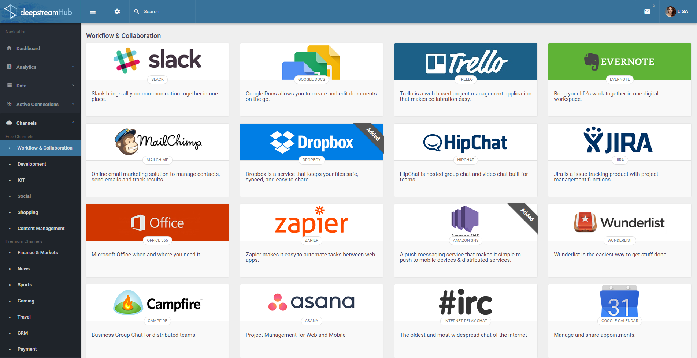

Ever since we started working on deepstream.io, our open source realtime server, we’ve felt that it could be the foundation for something bigger: a platform that enables developers of all backgrounds to build stunning realtime apps. A platform that connects to a wealth of tools, services and third party systems. A platform called deepstreamHub.

We’ve been working hard over the last months to build this platform and today we are one step closer to that goal. We are thrilled to announce that we’ve closed a $1 Million seed round with BlueYard Capital.

It is an exciting experience to know that already over ten thousand developers are using deepstream to build realtime apps and that now some of the most pivotal figures in Berlin’s tech scene share our vision to develop it into a platform and make deepstreamHub a reality.

### What is deepstreamHub?

Deepstreamhub provides your application's realtime backend, so you don't have to build it yourself. It is an integrated service platform that browsers, desktops, servers, mobile apps and IoT devices can connect to using tiny client libraries.

DeepstreamHub provides three core concepts that form the building blocks of any successful realtime app: data­sync (as you might know from e.g. Firebase), pub/sub (as you might know from e.g. Pusher/PubNub) and request/response (as in e.g. Http or MeteorJS).

These building blocks by themselve provide a great foundation for any app, but deepstreamHub is about taking a step beyond ­ about creating a platform of easily accessible realtime services.

It lets every client perform realtime searches, send and receive emails, texts or push notifications, schedule periodic tasks, push jobs to queues and access an array of other development features.

But we won’t stop there. DeepstreamHub is about providing a rich and open ecosystem of third party integrations that allow users to stream data from and to messengers like Slack, developer platforms like GitHub, social networks, IoT endpoints, payment providers, open data sets etc.

### Who is deepstreamHub for?

Users are increasingly expecting real time apps. And any team building one ­ from social messaging, collaborative document editing or realtime geolocation services to split­second stock price delivery and IoT data distribution ­ can save time and development cost by integrating with  deepstreamHub.

deepstreamHub’s extremely fast message delivery makes also makes it a good fit for demanding use cases like multiplayer gaming or finance, while its third party integrations make it a great time­saver for tech­verticals like messenger­as­a­platform, aggregation dashboards or process monitoring.

### Why open source first?

DeepstreamHub is based on deepstream.io, a realtime server that’s fully open source and has already seen great traction in the community. While it seems counterintuitive to make the core of your service available for free, this is increasingly becoming an industry standard ­ and for two very good reasons:

A great and supportive community. We believe in open source and are proud to say that despite its young age deepstream.io is already powering production apps and has gathered a great community of explorers, tinkerers and contributors.

Less technical risk / vendor lock­in: A common and justified concern about building applications on top of platform­as­a­service offerings is the associated third party risk. The recent shut­down of popular services like parse.com has increased this concern. By open sourcing the core of our stack from day one, we provide a valuable fallback and alleviate this risk.

    
    <label>deepstreamHub founders Wolfram Hempel &amp; Yasser Fadl</label>

### What’s next?

DeepstreamHub is an ambitious undertaking that can change the way realtime applications are built, so we are working on it feverishly until it is ready to release into the wild.. If you’d like to be among the first to take it for a test­drive, make sure to sign up [here](https://deepstreamhub.com/#newsletter). In the meantime we will also continue to develop deepstream.io together with our community.

Stay up to date by following us on [Twitter](https://twitter.com/deepstreamIO) and if you’d like to join us in reshaping the realtime web, browse our [open positions](https://deepstreamhub.com/careers/)

