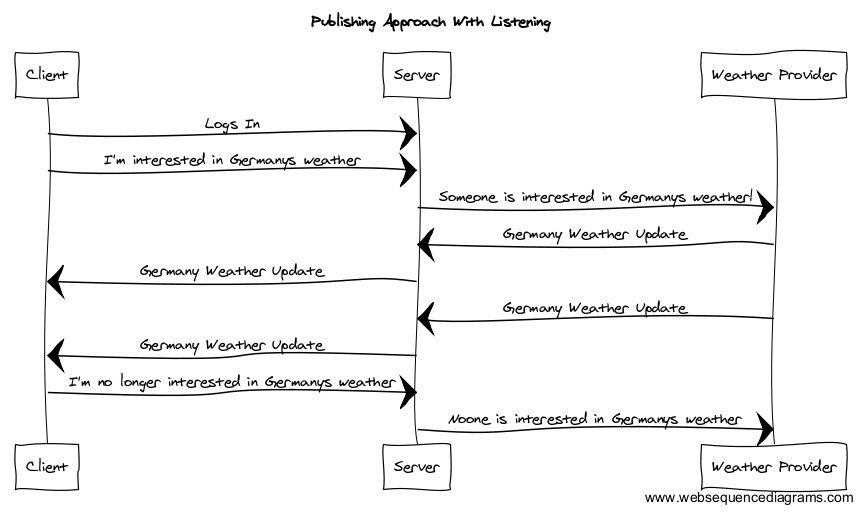

Realtime systems have a reputation of being expensive to run. Lets take a look at why - and what we can do to make it better. But before we start, let’s take a quick look at how many realtime systems work today.

Realtime uses the [push](https://en.wikipedia.org/wiki/Push_technology) paradigm to tell the world when something happens. This means it sends updates immediately rather than wait to be asked.

Where this all gets really interesting is on the very other end of your stack, in the land of databases, your server code and integrations with third-party data. Pretty much the rest of the iceberg that makes your application functional but is hidden away behind a beautiful minimalistic interface. Those systems tend to be run in a bit of isolation, meaning they often don't know or care if any clients are actually interested in what they are publishing or if they're literally just creating redundant data no one will ever notice (other than the people from devops monitoring your resource consumption).

Let’s take a weather app for example. As you can see in the image below, you have a large amount of changing data being constantly pumped into the system, although the client is only interested in Germany.


### So where does listening come in?

The goal in any realtime system is to limit the amount of moving data in order to reduce the total required resources and costs. One way to achieve this is by making sure that at least one client has actually requested something before you start pushing data to it.

This works amazingly well for events, as the responsibility is taken off the publisher to submit all events constantly. If you look at this in context of hardware, like IoT sensors, it could result in huge improvements in energy usage, since the device can suspend activity until it knows it's needed. In context of software, it reduces the load on the system significantly since only required events would ever be fired. As you can see in the image below, a publisher that is aware of what data is requested has much less activity with the same result.



Finally, this approach shines the most when the data being sent out is actually driven by the name of your subscription. For example, subscribing to 'weather/germany-berlin-1w' tells the publisher to send information for one week forecasts.
#### How to implement

The provider listens to events matching the name 'weather/'

```javascript
client.event.listen('^weather/.*', onMatch)
```

And the `onMatch` callback will be notified for all the current matches in the system, new ones that come in and old ones that no one is interested in anymore.

```javascript
function onMatch(subject, isSubscribed, response) {
  if (isSubscribed) {
    if (/* if you want to provide */) {
      response.accept()
      // start publishing data via `client.event.emit(subject, /* data */)`
    } else {
      repsonse.reject() // let deepstream ask another provider
    }
  } else {
    // stop publishing data
  }
}
```

If the provider can no longer provide the data, it can stop listening by calling:

```javascript
client.event.unlisten('^weather/.*', onMatch)
```

#### How it scales

You don't want more than one publisher updating the same record or emitting the same event. But you do want to scale your publishers so they can cope with huge amounts of data coming into your system, often from the same third party service. You can use the listen functionality to easily split concerns by handling more specific requests across multiple publishers.

For example, you could create two identical providers except where one listens to requests to all countries starting with the first half of the alphabet '^weather/[a-k]' and the other to the second half '^weather/[m-z]'. This can be split into as many publishers as you see fit to easily scale your processes.

For more details and code, take a look at our [tutorial](../../tutorials/core/active-data-providers/).
