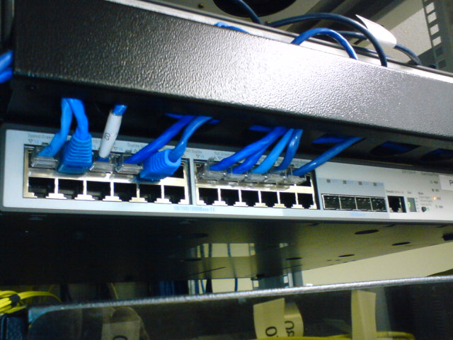
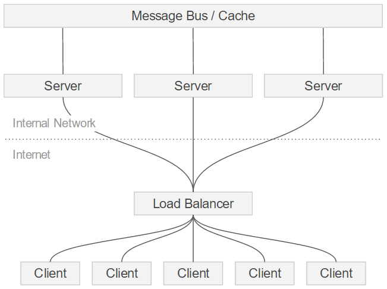
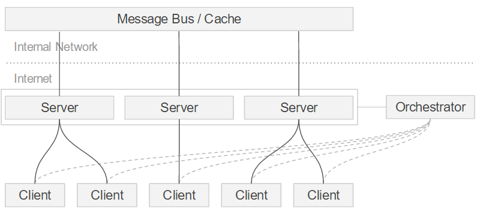
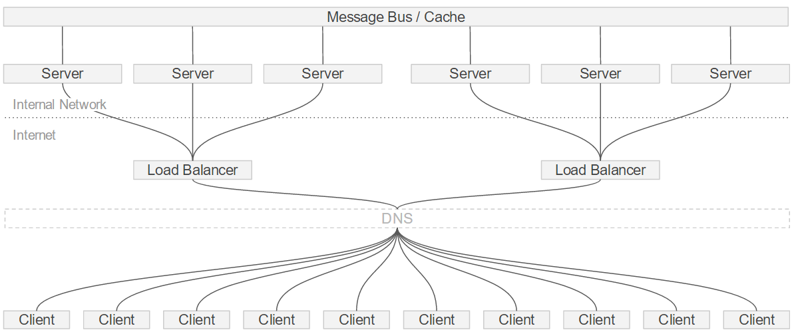

Loadbalancing for Websockets sucks. But I guess we can't complain. HTTP has been around for 27 years and we had plenty of time to develop a mature infrastructure to handle traffic for even the biggest websites.

WebSockets on the other hand only became a standard in 2011 and we're just starting to create the infrastructure necessary to use them at scale.

## So what's the problem?
In a word: Concurrency. Traditional load balancing approaches are geared towards short lived requests that yield an immediate response. This means that even a traffic heavy site with a million requests per minute that take ~10ms to complete will stay well below 200 concurrent connections at any given point.

Websockets on the other hand are persistent - this means that a large number of connections needs to be kept open simultaneously. This comes with a number of challenges:

### File Descriptor Limits
File descriptors are used by operating systems to allocate files, connections and a number of other concepts. Every time a loadbalancer proxies a connection, it creates two file descriptors - one for the incoming and one for the outgoing part.

Each open file descriptor consumes a tiny amount of memory, the [limits of which can be freely assigned](http://www.cyberciti.biz/faq/linux-increase-the-maximum-number-of-open-files/) - a good rule of thumb is to allow 256 descriptors for every 4MB of RAM available. For a system with 8GB of RAM, this gets us about half a million concurrent connections - a good start, but not exactly Facebook dimensions just yet.

### Ephemeral Port Limits
Every time a loadbalancer connects to a backend server, it uses an "Ephemeral Port". Theoretically, 65.535 of these ports are available, yet most modern Linux distributions [limit the range to 28.232 by default](http://www.ncftp.com/ncftpd/doc/misc/ephemeral_ports.html). This still doesn't sound too bad, but ports don't become available straight away after they've been used. Instead they enter a [TIME_WAIT state](http://www.isi.edu/touch/pubs/infocomm99/infocomm99-web/) to make sure they're not missing any packages. This state can last up to a minute, severely limiting the range of outgoing ports.

### Session allocation for multi-protocol requests
Most real world bi-directional connectivity implementations (e.g. [socket.io](http://socket.io/) or [SignalR](http://signalr.net/) ) use a mix of Websockets and a supporting protocol, usually HTTP long-polling.
This was traditionally done as a fallback for browsers lacking Websocket support, but is still a good idea as the leading HTTP request can help convince Firewalls and network switches to process the following Websocket request.

The trouble is: Both HTTP and WebSocket requests need to be routed to the same backend server by the load-balancer (sticky sessions). There are two ways to do this, both of which come with their own set of problems:

- **source-IP-port Hashing** calculates a hash based on the client's signature. This is a simple and - most importantly - stateless way to allocate incoming connections to the same endpoint, but it's very coarse. If a large company's internal network lives behind a single NAT (Network Address Translation) gateway, it will look to the loadbalancer like a single client and all connections will be routed to the same endpoint.

- **cookie injection** adds a cookie to the incoming HTTP and Websocket requests. Depending on the implementation this can mean that all loadbalancers need to keep a shared table of cookie-to-endpoint mappings. It also requires the loadbalancer to be the SSL-Termination point (the bit of the network infrastructure that decrypts incoming HTTPS and WSS traffic) in order to be able to manipulate the request.

## The Solution(s)
Loadbalancing Websockets is a tough problem, but not an unsolvable one. Various solutions exist. They can broadly be categorized as: DNS, Hardware Layer 3 and Software Layer 3 or Layer 7. Phew, sounds tricky... let's look at them one by one:

### DNS Loadbalancing
The Domain Name System is a decentralized network of nodes that sits between you and the server you want to reach. It translates domains (example.com) into IPs and... let me stop here, I'm sure you know all this already.
What's important in our context is that DNS has a many-to-many relationship between domains and IPs. A single A-Record (domain) or C-NAME (subdomain) can resolve to multiple IPs and the DNS will route requests in a round robin fashion.

**The upsides** are that DNS is incredibly resilient and scalable. Should it ever be unavailable, your problem is most likely more of an apocalyptic nature than a technical one. DNS also isn't something you'd need to maintain, so you pretty much get your load balancing for free.

**The downsides** are that DNS loadbalancing is very basic. DNS doesn't perform healthchecks (although some cloud provider based name servers do, e.g. [AWS Route 53](https://aws.amazon.com/route53/)), doesn't provide SSL termination, doesn't allow for complex weighting algorithms and will continue routing traffic to configured endpoints, regardsless if they're reachable or not. DNS Zone files are also heavily cached, so changes can take a while to propagate.

### Hardware Layer 3 / 4 load balancers
Ok, what's with these layers? The notion of layers stems from the [Open Systems Interconnection model](https://en.wikipedia.org/wiki/OSI_model), an attempt of categorizing network interaction in an abstract, technology independent way. Highly simplified:

- **Layer 3** is the abstract networking layer - this is where the internet protocol (IP) lives and raw packets are sent.

- **Layer 4** is the transport layer that has concepts of acknowledgments, resends etc. It's the realm of the Transmission Control Protocol (TCP).

- Moving a few layers up, the final bit that's important for load balancing is **layer 7**, the application layer. This is where complex, content aware and feature rich HTTP messages are sent.

The fastest and most powerful loadbalancing mechanism after DNS are hardware level 3 switches. They usually come in the shape of "blades" that can be slotted into a blade server rack.

It is however 2016 and most of us have probably gotten quite comfortable leaving this sort of thing to [AWS](https://aws.amazon.com/), [GCP](https://cloud.google.com/), [Rackspace](https://www.rackspace.com/) or [Digital Ocean](https://www.digitalocean.com/) etc., so we'll just leave it at that.

### Layer 3 / 4 / 7 software loadbalancing
Using a software loadbalancer is in many ways the easiest and most flexible solution. There are a lot of great servers to choose from for this task, e.g. [Nginx with the Stream module enabled](https://deepstream.io/tutorials/integrations/other-nginx/), [HA Proxy](http://www.haproxy.org/) or [Apache with mod_proxy](https://httpd.apache.org/docs/current/mod/mod_proxy.html) to name just a few.

**The upsides** are plentiful. Most solutions in this space can perform a multitude of tasks, such as health checks, SSL termination, cookie injection or IP hashing. They're (comparatively) easy to set up and maintain, well documented and fast enough for most usecases.

**The downsides** are associated with connection concurrency: Software loadbalancers/reverse proxies run on a single machine. They are subject to that machine's File Descriptor and Ephemeral Port limitations and often heavily utilise it resources. This provides a hard limit to the number of concurrent connections that can be handled which makes the LB the scalability bottleneck / single point of failure within an architecture.

### Orchestrator approach
An interesting alternative to traditional load balancing concepts is the use of an Orchestration Server. This server keeps track of the available backend nodes, performs health checks and cluster management tasks. On top of this it keeps an array of external URLs of backend servers and provides an HTTP API for clients to retrieve an endpoint URL.

Orchestration Servers are a common concept in cluster architectures, e.g. [Apache Zookeeper](https://zookeeper.apache.org/) or [Redis Sentinel](http://redis.io/topics/sentinel)

**The upsides** are mainly scalability and flexibility. Orchestration servers provide a simple HTTP API to retrieve endpoint URLs to clients. This API is very lightweight and can be traditionally loadbalanced. Since clients will connect to endpoints directly, there are no limitations associated with concurrency and no need to inject cookies or use other methods to allocate sessions.
What makes this solution particularly powerful is its flexibility which allows for the implementation of high level ressource utilisation concepts. An orchestrator can base its endpoint allocation on very detailed data from the backend nodes and the incoming client connection.

**The downsides** are that every endpoint needs to be publicly accessible. For TCP connections this requires a dedicated IP per endpoint. Likewise, this solution lacks the additional layer of security that's added by a load balancer. To offset this, it might make sense to front each endpoint with its own reverse proxy.

## Conclusion
So, what's the best choice? As so often, the only true answer is: It depends!
All loadbalancing approaches described above will help facilitate small to medium deployments effectively, but for a truly scalable setup you're probably best of with a hybrid approach.

Something often used in practise is a combination of multiple smaller groups of backend servers, fronted by a software load balancer. DNS in turn is used to route traffic to the individual load balancers. This adds an extra layer of indirection and can be enormously scalable, but comes with added complexity and an additional network hop for information to pass through.

Orchestration server / endpoint allocation approaches on the other hand allow for very large deployments and make it possible to manage the available resources most efficiently, but require a lot of bespoke development.

Cloud Hosting providers can take a lot of heavy lifting of you, but even there the support for large scale websocket deployments is still in its infancy.
