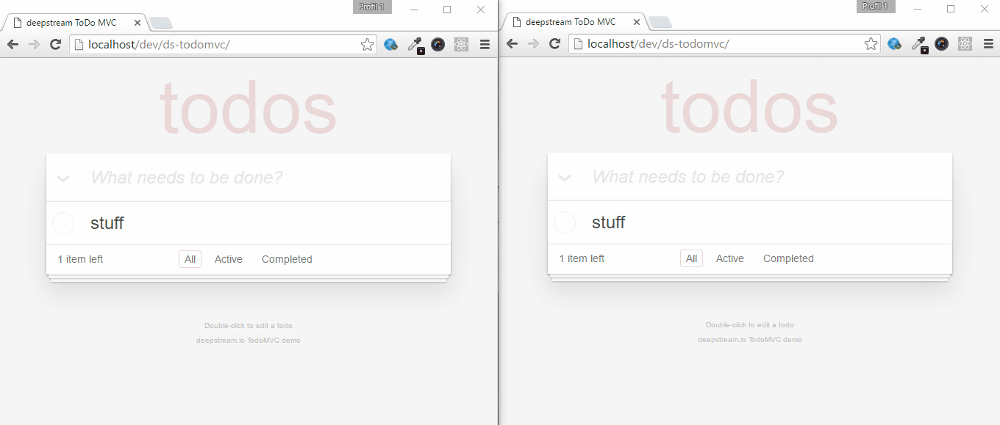
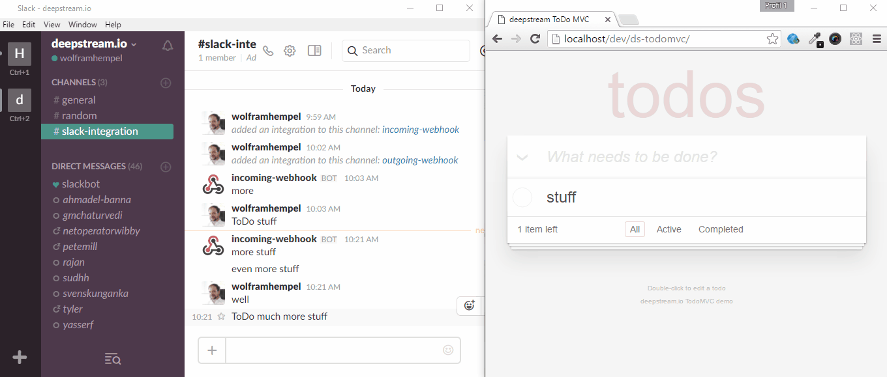
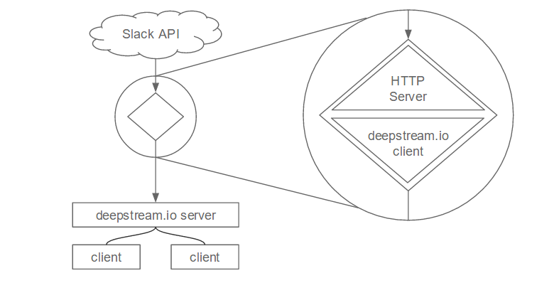
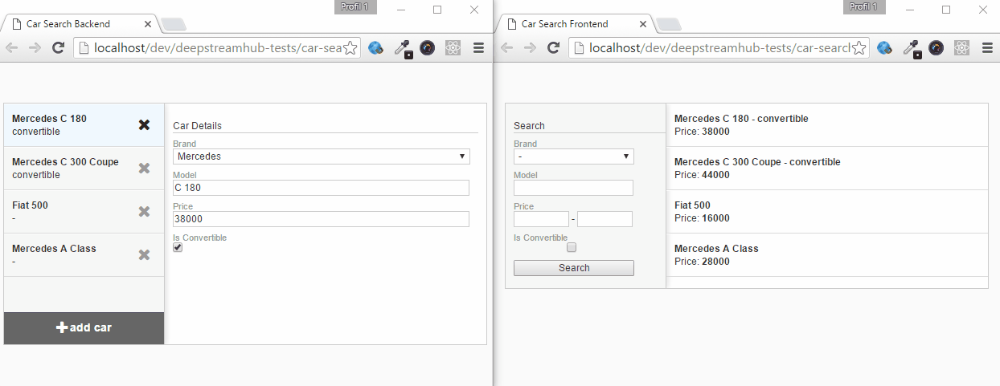
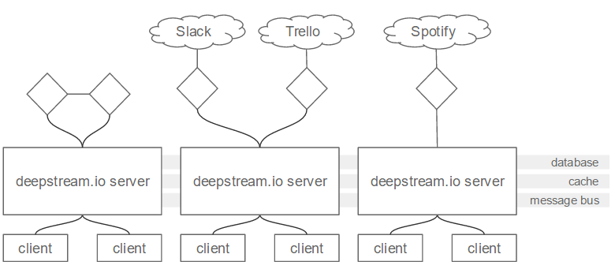

Not too long ago, this post would have started with a flaming manifesto for microservices. “Break down the monolith!”, “Divide and Conquer!”… you know the drill. Today though, that’s hardly necessary. In fact, cloud platforms like AWS make it next to impossible NOT to architect your backend as a swarm of loosely coupled processes.

So… no more passionate manifestos? Well, maybe one more: Make them realtime!

### Realtime?
Most microservices interact in one of two ways: Via HTTP communication or via message queues. With deepstream, we’d like to suggest a third: Distributed state.

At its core, deepstream is a container for distributed states which can be observed and manipulated by frontend clients and backend services alike. This makes for a potent recipe for realtime apps.

Let's look at a couple of real world usecases to see what this would look like.

<h3 class="section">The simplest usecase - no custom backend at all.</h3>

Let's start with a simple todo list. Syncing your todos between clients and storing them in a database takes no custom backend code whatsoever. All you need is a deepstream server that your clients connect to and optionally a database or cache.

<h3 class="section">Connecting to a third party API</h3>

For many SaaS applications, extensibility and an active developer community is key to success. Slack is a perfect example for this: it offers both outgoing and incoming "webhooks" - http endpoints that will be called when messages are to be sent or received.

To connect deepstream to Slack, we’d need to create a “provider” - a small process that sits between both endpoints and forwards messages in either direction.

Our Slack provider connects as a client to deepstream on one side and spins up a HTTP server on the other. Whenever an entry is added to a todo-list, the provider gets notified and sends an HTTP request to Slack. Whenever a trigger-word is mentioned on Slack, it receives an HTTP request and stores its payload as a deepstream record.

Please find a simple implementation of the deepstream-slack connector used in the example above [here](slack-connector.js)

<h3 class="section">Connecting to a database</h3>

Often it makes sense to derive enhanced data from deepstream's database, for instance for aggregated values (Sums, Averages) or extended query functionality.

deepstream offers a number of out of the box providers for common requirements. To achieve realtime search in your document (as in the example above), just get the latest [rethinkdb search provider from the downloads page](https://deepstream.io/download/) and plug it in between your server and your database.

<h3 class="section">But how does this scale?</h3>

Very well indeed. Deepstream is built to scale horizontally via a message bus and performs well as a messaging and data backbone for realtime applications.

Since state is synced between all connected servers it doesn't matter which endpoint your microservices connect to. On top of that, deepstream has a number of built-in features that help help scale backends more easily, e.g. via load balancing remote procedure calls between multiple redundant providers.

