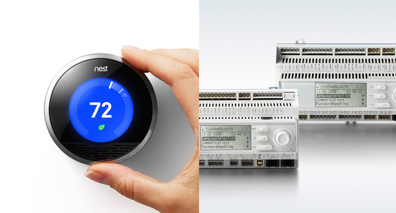

A few years ago, when the first Rasperry Pi’s hit the scene, I was working at a tech company building trading apps. Like so many, the company had a strong focus on engineering with about 70 developers pitted against just 4 designers.

One day, a package arrived. Naturally, the man that came to pick it up had a beard - but a well groomed one. He - of course - wore a checkered shirt - but I couldn’t help notice that it was not only ironed, but also matched his shoes. And yes, he carried a laptop everywhere. But the laptop he carried was a Mac and the bag he carried it in was vintage leather. In short, he was a designer - and the package contained the first Raspberry PI I’ve ever seen.

Surprisingly few of the techies cared about this strange machine at first, but the UX team got excited straight away, started playing with it and argued about its cool new use cases.

#### How come?
Raspberry PIs are part of a new generation of clever IoT devices: Arduinos, Nest Thermostats or Philip’s remote controllable light bulbs - easily accessible, well designed and sleek (ok, maybe not Arduinos).
They appeal to a wide audience and spark the imagination of users, founders and investors alike. And most importantly, they excite us about what's to come: smart homes, self driving cars and connected everything - in short: the sexy IoT.

But, the Internet of Things isn’t new. At all. And while more than five million Rasperry PIs or a potentially even bigger number of Arduino copies sold around the world make for impressive numbers, they are severely dwarfed by the other IoT. The older IoT. The unsexy one.

    
    <label>Nest Thermostat and Siemens Climatix 600 Controller</label>

#### The other IoT
Many of the IoT’s core use cases: Building and home automation, environmental monitoring or infrastructure management not only precede the current generation of devices, they precede the World Wide Web itself.
BACnet, still one of the most widely used building automation protocols was developed in 1987, LonTalk in 1988 and X10, a granddaddy of modern smart home protocols like ZigBee or Z-Wave goes back as far as 1975.

So, how come the IoT only recently became the “next big thing”?
I would argue that the IoT has always been big, it’s the personalized IoT that has taken the spotlight lately. This is fueled by the alignment of a number of trends

- Hardware production costs dropped significantly, making the IoT cheaper and facilitating micro-appliances like Amazon’s Dash button or Roost’s smart batteries

- We have become more comfortable with sharing personal data, e.g. when it comes to incorporating wearables or fitness trackers into our daily routine.

- Producing faster microprocessors more cheaply enables IoT devices to run high level programming languages like Node that have a wider degree of adoption

#### But it’s not like the old IoT has stagnated either
 

- It is now almost completely based on open protocols, rather than the proprietary ones of the past that were used to tie customers to a specific vendor.

- IPv6 has massively increased the number of available IPs, allowing every sensor and relay within a system to be addressable from the public internet

- UX and Usability is playing an increasing role in the design of Management Systems. (It’s still a long way away from e.g. Nest’s products, but there is a clear trend)

#### Crossing the chasm
However, at the moment, there is still a huge chasm dividing both IoT’s. The reasons for this are complex, but amongst them are the differences in culture, technology, agility and enterprise-suitability that distinguish the companies in both spaces.

There is, however, enormous opportunity in crossing this chasm. The new IoT provides valuable data about its users, their habits, daily routines and preferences. The old IoT generates detailed information about the environment they interact in. Combining both with big data crunching technology will lead to unprecedented (and slightly scary) insights into individual user’s behavioral patterns as well as into the systems they compose.

#### What does it take to unite both IoTs?
There are a number of possible integration and normalisation approaches for aggregating both IoTs.
For [deepstreamHub](//deepstreamhub.com/), our upcoming realtime data platform we use a concept of channels: pre-built integrations with third party services that allow you to directly stream realtime data, say Slack Messages or Stock Prices into your app.
But channels are bidirectional and could as well be used to control building management systems, process automation or even integrated healthcare. As long as you have a TCP endpoint, all it takes is to point your deepstreamHub channel towards it and its data and commands become available as a high level API within all connected browsers and backend processes.

We’ve only just started looking into the possibilities of interfacing with the old IoT. If you’ve got experience in the space and feel that this is either an absolutely superb or completely terrible idea: we’re very eager to hear your thoughts! ([@deepstreamIO](//twitter.com/deepstreamIO))

