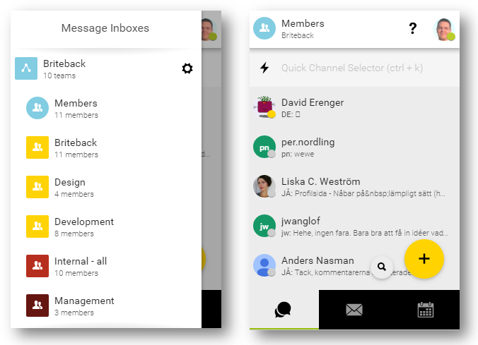
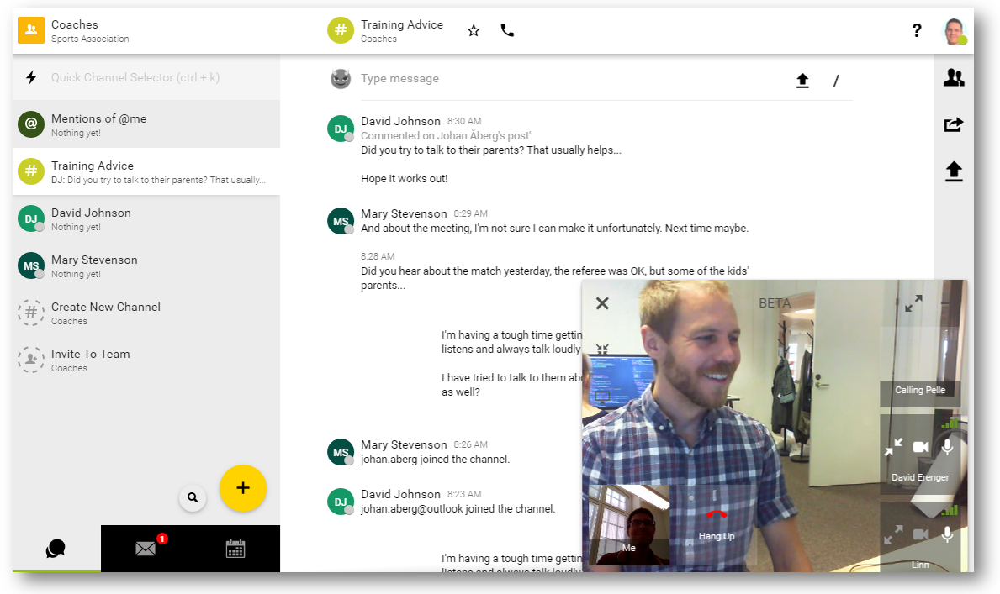
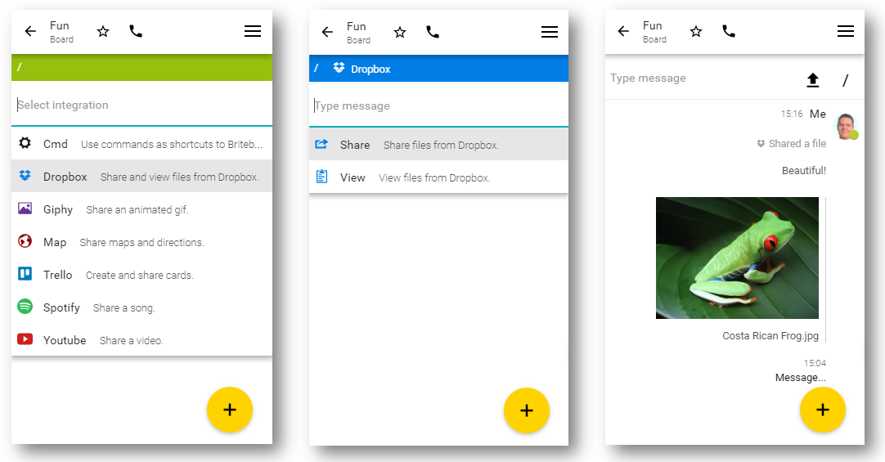

What have you’ve been doing at work today? Your actual work? Or sifting through an endless stream of emails, both from externals and co-workers alike that wanted to discuss - well - even more incoming emails they’ve received.

Reports have found out that we spent [an average of 6.3 hours each workday](http://www.huffingtonpost.com/entry/check­work­email­hours­survey_us_55ddd168e4b0a40aa3ace672) reading, forwarding and replying to mails. So couldn’t we just stop and instantly become 70% more productive? Sounds intriguing, but the simple fact is: email is and continues to be the main means of business communication… 

Fortunately though, there’s something else we can do: use it much more efficiently!

[Briteback](https://briteback.com/), a fast growing technology company based in Sweden set out to help you do just that. 
Their app helps you replace internal emails with messaging for more effective communication. And external emails? With Briteback’s email Power Up, just share them into a messaging channel and discuss them there. No more forwarding and reply-all, and all decisions are traceable internally, not stuck in individual inboxes. Briteback also has full support for online-calls and calendars, and integrates the other important work applications you rely on for project management, sales, etc.

Instant realtime communication, a granular permission model and a keen eye on security make Briteback a powerful tool for growing startups and large enterprises alike.

But with requirements like these, finding a reliable realtime technology that could scale with the company, was secure, quick to deploy, easy to extend and offered the performance to cater for demanding business use cases proved no easy task.

### How deepstream helped Briteback take enterprise messaging to the next level

After extensive benchmarking and evaluation, Briteback decided to use deepstream as the backbone for realtime communication across desktops, mobile devices and microservices and has worked with it ever since.

<blockquote>
    
deepstream is a perfect technology fit for us; scalable, performant, secure and does one thing only and does it well.

    

    It does not tell us how to structure our system nor how to write our code, making it a breeze to integrate with the rest of our systems, adding value without interfering.

    David Erenger, CTO Briteback
</blockquote>

### Reduced time to market 
Using deepstream, Briteback could save a major share of backend development time. Both realtime data and request/response workflows are handled out-of-the-box just as database management, routing, failover and clustering. This allowed Briteback to fully concentrate on their core values, creating an outstanding user experience, well designed workflows and extensive communication capabilities.

### Powerful Permissions 
Briteback is designed to cater for the demanding requirements of even the largest enterprises. It’s access control model allows for fine grained permissioning, role-based grouping, intersecting groups, individually elevated rights and dynamic permission changes.

With thousands of lines of permissioning logic, this proved to be an extremely challenging requirement. Deepstream’s multitude of authentication and permission strategies, granular per-message checks and encrypted connections made it possible for Briteback to offer the fine-tuned security model that enterprise customers demanded.

### Less Devops 
When it comes to instant messaging and team communication, high availability and low latency is key. With deployments in datacentres across the world, Briteback needed a solution that could be rolled out, maintained and updated with very little overhead.

Deepstream’s minimal installation, simple configuration and millisecond startup time proved to be a good fit for that. What made Briteback’s usecase particularly challenging was the need to use the same system for both cloud deployments and on-premise versions for enterprise customers. With distributions for most major Linux versions, Windows, Mac and Container environments, deepstream offered this flexibility and fitted a wide range of environments and architectures.

### Conclusion 
Reduced complexity and ease of use allowed Briteback to significantly accelerate time to market, but the true challenge has only just begun. Since working with deepstream, the company has seen significant growth. Deepstream’s  horizontal scalability and decentralized clustering support will continue to ensure that infrastructure won’t be a bottleneck on Briteback’s rise, no matter the scale.

### Resources
- Briteback Website: https://briteback.com/
- Deepstream Website: https://deepstream.io/
- Press Contact: [amy.fleming@deepstreamhub.com](amy.fleming@deepstreamhub.com)

### About Briteback
Briteback is a start-up within the IT sector, with its headquarters located in Norrköping, Sweden. The company was founded in late 2014 by Johan Åberg (CEO), David Erenger (CTO), and Per Nordling (Chairman of the board). With Johan Åberg’s background as an assistant professor in Computer Science at Linköping University, Briteback is built on scientific knowledge and research within the fields of team communication, interaction design, and electronic commerce. Briteback is based on the idea that team communication can only be efficient - and team member satisfaction guaranteed - if knowledge sharing is easy, fast and transparent.

### About deepstream
deepstream is an open source realtime server, build by deepstreamHub GmbH in Berlin. Founded by two ex-financial trading technologists and developed by a fast growing team and an awesome community, it is increasingly becoming the technology standard for collaboration and communication apps, realtime dashboards, casual multiplayer gaming, financial trading & auctions.