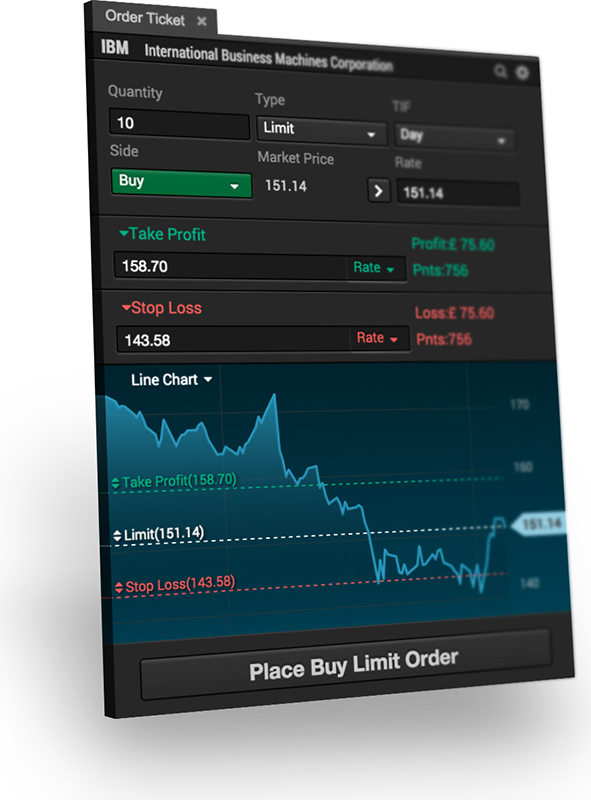

When we started, we were a small team of investment banking and trading technologists with an ambitious goal: we wanted to build the best trading platform there was; fast, responsive, with a multitude of tools, clever workflows based on multi component linking, browser and mobile support, easily accessible, themeable and so on...

And we’ve built it… well, to an extent at least. We called it “the Merchant”

<iframe src="https://player.vimeo.com/video/143728632?title=0&byline=0&portrait=0" width="780" height="438" frameborder="0" webkitallowfullscreen mozallowfullscreen allowfullscreen></iframe>

<a href="https://vimeo.com/143728632">The Merchant - Stock Trading Platform</a> from <a href="https://vimeo.com/hoxtonone">Hoxton One</a> on <a href="https://vimeo.com">Vimeo</a>.

Our plan was to offer it to retail brokers and trading houses as a hosted service, pluggable into any FIX/FAST stream. Reception was great and there was plenty of interest on the market - but we quickly came to realise two things: FIX implementations in the retail space vary widely, making this a foreseeable maintainability nightmare.

And - more importantly - we’ve actually developed something far more valuable in the process.

### Serendipity
We knew from past experiences that the most important aspect of any trading platform, financial realtime dashboard, stock screener, forex aggregator etc. is the realtime data backbone.

And we knew that the market for this sort of technology was fairly strange and unique. Companies like Kaazing, Caplin, Sungard, Software AG and others started building proprietary pub/sub servers for price distribution almost a decade ago and have since extended and strengthened them into huge and massive realtime distribution behemoths

We wanted to build something different, free and open source: We called it deepstream

deepstream is designed as a swarm of small and nimble servers - cheap to run and scale via decentralized clustering. Each instance is single threaded with non-blocking I/O, an increasingly popular paradigm shared by e.g. Redis or Node that’s particularly suited for cloud deployments. Many processes can run in horizontally scalable clusters, interconnected via a message bus or directly via IP/Multicast or TCP. The benefit is that it makes little to no difference if these processes run on a single multi-core machine or are spread out over many small machines  within a data-center or VPN.

Nodes can be added and removed from a live system without any downtime. Failover and replication is instant and very cheap - a fundamental paradigm-shift from the last generation of hot/cold failover scenarios and costly backup stacks.

What makes deepstream really stand out though is its versatility. Rather than just being a pub/sub server it offers three concepts that make building complex workflows a breeze: data-sync, publish-subscribe and request-response.

### Data-Sync 
Data-Sync is a means of storing schemaless, stateful data-structures called “records” and sending changes in realtime. A record is identified by a unique name, e.g. “eq/goog” or “fx/gbpusd” and can contain any number of static (RIC, symbol, any fundamental data...) and dynamic fields (bid/ask price, sales margin...).
deepstream uses a proprietary, minimalistic protocol to sync changes and send deltas with very little overhead. Benchmarks show that the average latency for a price update to travel from a provider through deepstream to a client is around 1ms (tested under load @ 10k messages per second, machines in immediate network proximity, more details here[])

### Pub-Sub
Time-and-sales, transaction indicators on a ladder, popup notifications… a lot of the data within a trading platform is ephemeral one-off information. For this category, traditional pub/sub is still a great choice - and our server offers just that. deepstream’s “events” are distributed across the cluster. As with anything within deepstream, topics are created on the fly, simply by publishing or subscribing to them.

### Request-Response
Booking a trade, requesting a large chunk of historic chart data or retrieving content from your analysts - these are examples of request-response workflows (called remote procedure calls or RPCs in deepstream).
Any process connected to deepstream can register as a “provider” for an RPC and any process can “make” an RPC. deepstream will route the request to the right provider within the cluster, handle loadbalancing / failover between multiple providers for the same RPC and safely deliver the response back to the requesting client.

### Supporting Features:
These concepts are backed by a number of supporting features

#### Listening
Providers can not only subscribe to records and events, they can also listen to other clients subscriptions. That means that a provider for NASDAQ stock prices could listen for a pattern like `NASDAQ/*’. Once the first client subscribes to ‘NASDAQ/AAPL` the provider is notified and can start providing data for the stock.
This allows for the creation of efficient “active” providers that only send out data if it's actually needed.

### Security & Permissioning
Strong encryption, granular permissions and impenetrable access controls are a must for a trading platform with execution capabilities. deepstream uses TLS for TCP connections and WSS/HTTPS for web facing endpoints - but that’s pretty much a given in 2016. Where it really shines is authentication and per-message permissioning.

#### Authentication
deepstream authenticates every incoming connection individually using flexible authentication strategies (e.g. file, Http-Webhook) that make it easy to integrate with Single Sign On and Access Management Systems such as LDAP, CerBeruS or oAuth. As part of the authentication process deepstream also allows to load per-user roles and runtime permissions

#### Permissioning
deepstream uses a proprietary, functional and expressive permission language called Valve with a JavaScript like syntax. Valve rules are applied to every incoming record, event and rpc message and can be used to permission CRUD actions, validate data, check against conditions and limits and even cross-reference other data.

### SDKs and Frontend Libraries
deepstream is a standalone server that’s installed like any database or backend system via Linux package managers or as Windows or Mac executable. To connect to deepstream, clients need to use lightweight SDKs that are currently available with full support for all Browsers, NodeJS, Java and Android and partial support for .NET, Python and iOS.

deepstream also comes with plugins for popular frontend libraries such as ReactJS, Polymer or Knockout.

### Licensing and Open Source
deepstream is completely free and open source. The server itself is APGL licensed, similar to systems like MongoDB or Neo4J. This allows it to be used without restriction in any commercial or proprietary application. The client SDKs and plug-ins even come as completely open Apache 2 software.

To help you get started, deepstreamHub GmbH in Berlin offers training, consultancy and development and production support.

### Coming soon
A deep dive into grids, blotters, realtime charts and other core components of the Merchant and the underlying deepstream features that powered them.

