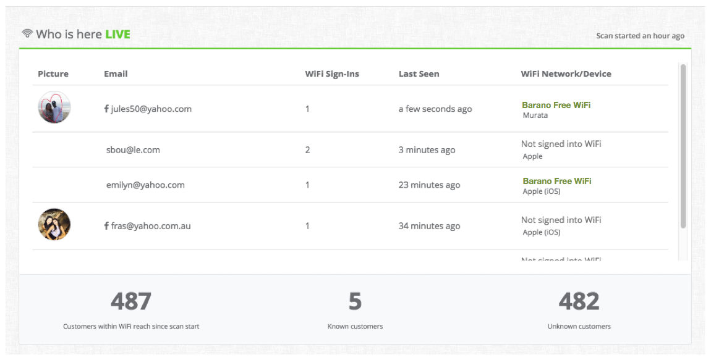
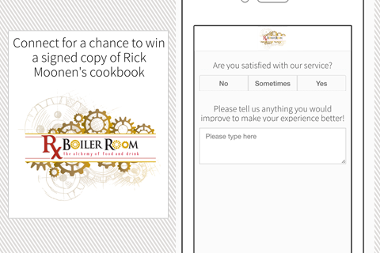

Ever thought of how nice it would be to unearth insights about your in-store customers - as easily as you can with online analytic tools? Obtain specifics on who’s shown up, the peak opening hours, repeat customers, how they navigate your inventory and how long they’ve been in the store?

With iValu8’s VivaSpot you can. Merchants rejoice!

The proximity marketing company from North Carolina developed a technology that tracks user behaviour via Wifi-contacts. While consumers are shopping, their smartphones constantly scan for available access points and provide anonymous, yet unique HMAC addresses. Vivaspot gathers this information to
track movement and behaviour of customers on their shopping days.

To enhance the data, Vivaspot also gives merchants the ability to grant free wifi to their clients. Shoppers sign up with their email address and the anonymized data-point turns into a highly valuable, permanent shopper-id that can be linked to associated online-information, purchasing
behaviour and movement patterns.

All this information is made available to participating merchants via realtime dashboards that provide detailed insights about their current and approaching customers. 

### A sizeable task
Shopping malls haven’t exactly gotten smaller in recent years. Larger centres like the Dubai Mall peak at well over 47 Million annual visitors and even smaller to medium sized outlets are frequented by hundreds of thousands of shoppers each day.
Tracking their movement and behaviour and relaying the right information to the right merchant is a monumental task - and Vivaspot needed a technology that could fit the bill. After moving out of Pub/Nub for cost-reasons and trying numerous alternatives, Vivaspot eventually discovered deepstream.

<blockquote>
    
deepstream fit our requirements like Karma. It was meant to be

    Vadim Kokhnovitch, Vivaspot CTO
</blockquote>

With close to ten-thousand data-points a second, Vivaspot needed a technology that was both reliable and fast - and deepstream’s event mechanism delivered just that. Customer information is streamed continuously to connected merchants, delivering details of up to several hundred customers in the immediate vicinity at any given moment. 

### Time to market
For a company with massive growth, quick turnaround times are key. deepstream’s ease of use and wealth of out-of-the-box features enabled Vivaspot to go into production just three weeks after its adoption and has been reliably powering their system ever since. Its seamless integration with Amazon Web Service’s infrastructure made it a breeze to set up and plug into
event streams and Lambda processing.

Having partnered with Cisco and Meraki, IValu8 is growing its operation in the US and is currently securing the next round of funding, iValu8’s Vivaspot Intelligent WiFi is shaping up to become a cornerstone of physical customer behaviour analytics.

<blockquote>
    
“We’re looking forward to extending our use of deepstream as our realtime data system grows” - said CTO Vadim Kokhnovitch - “it’s data-sync capabilities and integrations with numerous databases make it a great solution for a range of different challenges we face.”

</blockquote>

### About iValu8
iValu8 is a Cloud-based marketing company. Its VivaSpot Intelligent WiFi product quickly and easily converts ordinary WiFi networks into an automated marketing machine that drives repeat business and increased profits for merchants in the retail and hospitality
segment. 
For more information on VivaSpot, contact Andrew Fox (VP of Sales) -
[andy@ivalu8.com](mailto:andy@ivalu8.com)

### About deepstream…
deepstream is an open source realtime server, build by deepstreamHub GmbH in Berlin. Founded by two ex-financial trading technologists and developed by a fast growing team and an awesome community, it is increasingly becoming the technology standard for collaboration and communication apps, realtime dashboards, casual multiplayer gaming, financial trading & auctions.
To learn more, get in touch with Amy (Head of Communications) at [amy.fleming@deepstreamhub.com](mailto:amy.fleming@deepstreamhub.com)