If you're an AWS user, you've probably seen the big news today: Elastic Load Balancer has taken a big step forward and now supports HTTP/2 and WebSockets on a protocol level, rather than having to route packages directly.

This allows you to loadbalance your WebSocket traffic on its own path alongside your HTTP traffic - awesome!

But there are a few things that even the new ELB still doesn't do - chief amongst which is maintaining sticky sessions across protocols. 
Oha - what's that? Most WebSocket connections, e.g. those maintained by Socket.io, SignalR or deepstream use a combination of HTTP-longpolling and WebSockets to establish connections more quickly and mitigate certain obstacles like corporate firewalls. The trouble is: Both the leading HTTP request and the following WebSocket request need to be routed to the same endpoint by the loadbalancer.

But that's not the end of the world. Let's take a look at how to set up a small cluster of deepstream nodes using the new Application Load Balancer.

#### What we'll create

The outcome of this tutorial will be a cluster of two deepstream servers, running on EC2 Micro Nodes with an AWS Linux AMI, connecting to an ElastiCache Redis instance that will serve as both a cache and message bus fronted by the new AWS Application ELB.

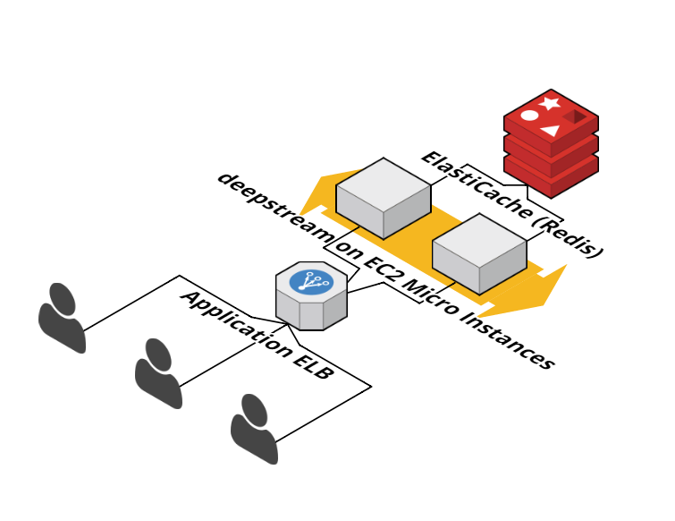

#### Installing deepstream on EC2
Let's begin by starting an EC2 micro instance and installing deepstream on it. To do that, just log into the AWS console, navigate to EC2 and hit that beautiful blue "launch instance" button in the top right corner.

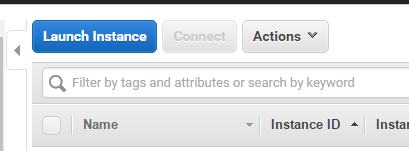

...pick AWS flavoured Linux...

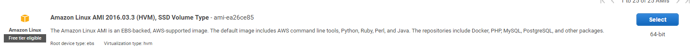

and go with a frugal micro instance (we can always beef it up later)...


...in security groups, make sure to open port 6020 (by default, you can change ports in [deepstream's config](/docs/server/configuration/#port))...

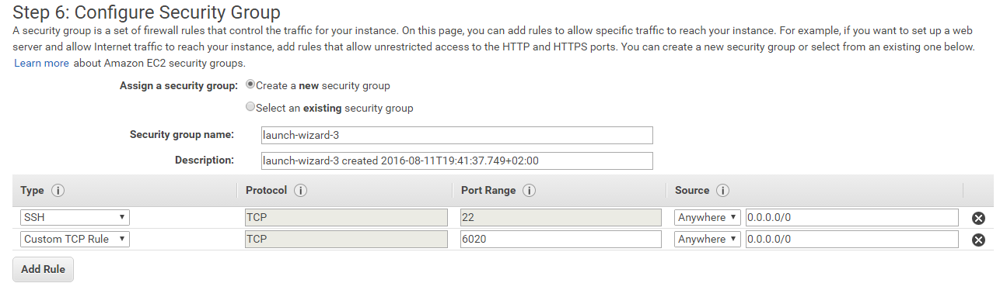

and launch your instance. Change to instance details, right click the row with your instance and click "launch more like this" to launch a second instance of the same type.


Once your instances are running, log into the first one using your SSH-key:

```bash
ssh -i <ssh-key-file>.pem ec2-user@<your-instance-public-dns>
```

### Installing deepstream
Deepstream is available as a [distribution for AWS Linux](/install/aws-linux/). 

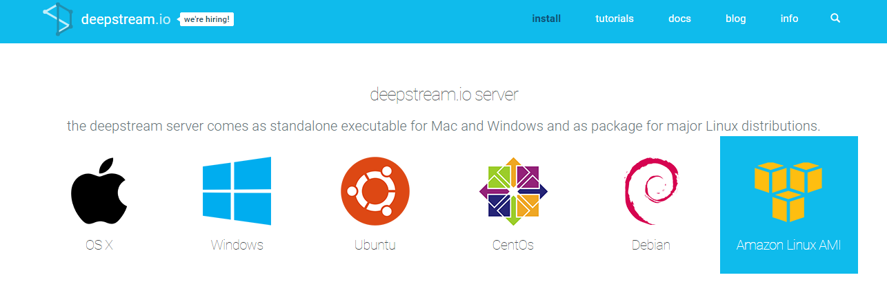

To install it, simply paste these lines into your ssh-terminal:

```bash
sudo wget https://bintray.com/deepstreamio/rpm/rpm -O /etc/yum.repos.d/bintray-deepstreamio-rpm.repo
sudo yum install -y deepstream.io
```

resulting in

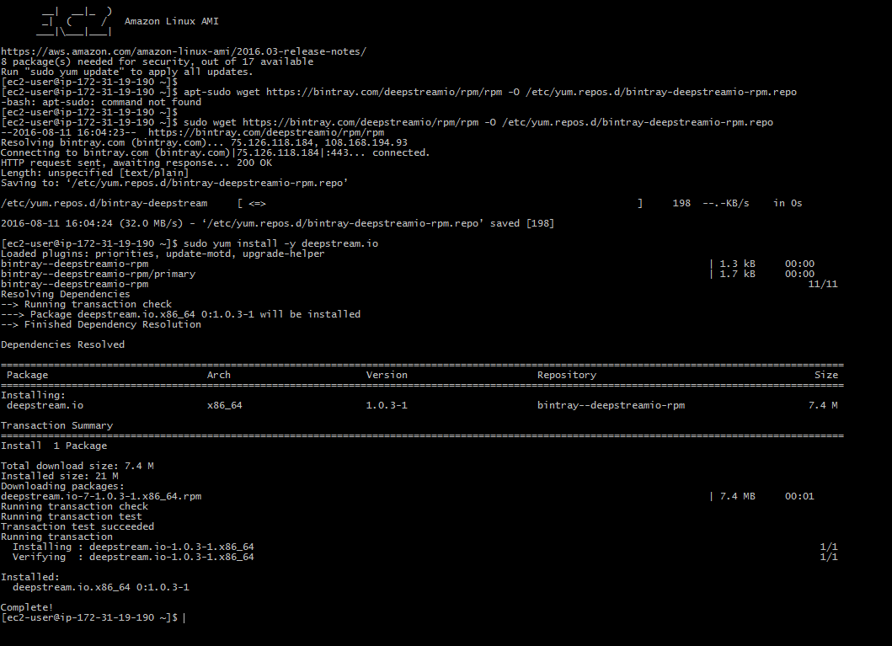

### Starting an ElastiCache instance
To scale horizontally, deepstream needs an external cache that all nodes can access - and AWS provides just such a thing with [ElastiCache](https://aws.amazon.com/de/elasticache/). Using Redis as a caching engine we'll get a fast cache and message bus at the same time.

To start an ElastiCache cluster, navigate to ElastiCache in the AWS console and click:

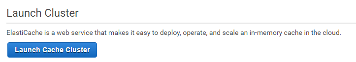

...select Redis as an engine and choose a (smallish) instance size and assign a name. (For this tutorial we'll disable replication)...

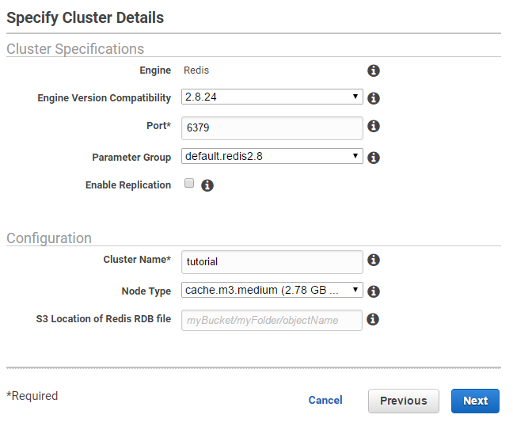

...don't fiddle with the advanced settings and launch your group. Once it's launched, click the unsuspecting link that says "1 node" to display your cache's endpoint host and port

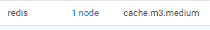

### Connecting to ElastiCache

Back to the SSH terminal for our deepstream EC2 machine. To connect to Redis we need to install a "connector" - and since we want to use Redis as both a MessageBus and Cache, we actually have to install two. Connectors can easily be installed using deepstream's command line interface:

```bash
deepstream install message redis
deepstream install cache redis
```

resulting in

.

Next up, we need to tell our newly installed connectors which endpoint they need to connect to. Just edit `/etc/deepstream/config.yml` and change the plugin section to

```yaml
# Plugin Configuration
plugins:
   message:
     name: redis
     options:
       host: <your elasticache host>
       port: <your elasticache port (probably 6379)>

   cache:
     name: redis
     options:
        host: <your elasticache host>
        port: <your elasticache port (probably 6379)>
```

Finally, let's start deepstream by running `deepstream start`.

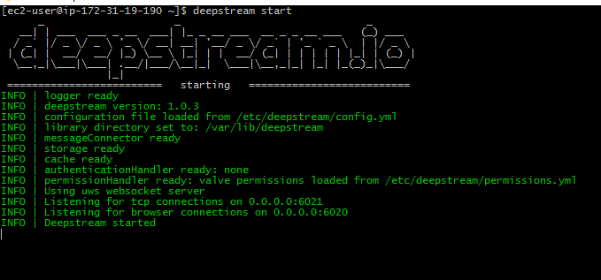

And that's it - oh, of course we need to do the same for the second EC2 machine as well :-)

### Configuring the loadbalancer
Finally it's time to configure the loadbalancer. To do this, head back to the console, navigate to EC2 and click "Load Balancers" on the left hand side, followed by "Create Load Balancer".

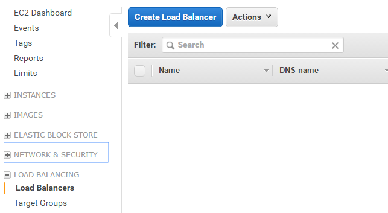

...choose the new application loadbalancer...

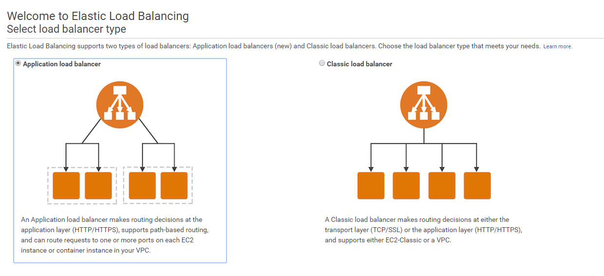

...configure it for both encrypted and cleartext traffic...

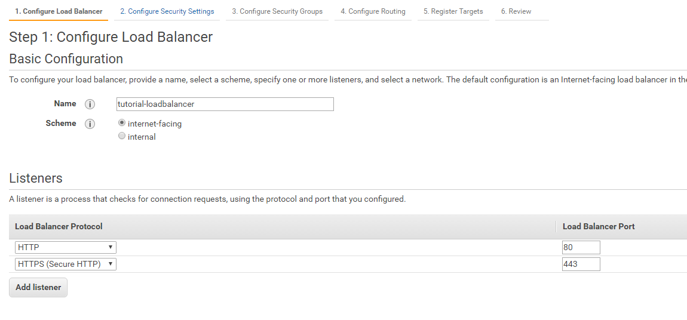

...choose a certificate (use the certificate manager to create one if there's none listed)...

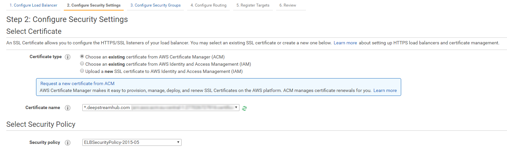

...stick with the default security group and fire the whole thing up. And that's it - you now have a fully functioning deepstream cluster running behind the new application load balancer. When connecting to it from a browser, make sure to limit the transports to WebSocket.

```javascript
ds = deepstream('<elb-dns>',{transports:['websocket']}).login();
```

