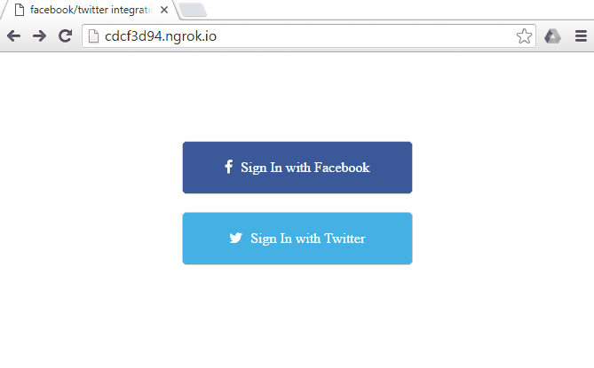

Let's face it, we each have multiple user profiles and maintaining all those different passwords just never worked. So when OAuth got introduced we let out a sigh of relief knowing those days are behind us. Behold, the second sigh, where deepstream can use the same OAuth-tokens to authenticate your users!

In this blog we'll be looking at using the power of [express](//expressjs.com/), [PassportJS](//PassportJS.org/) and a nifty [plugin](//github.com/demux/use-express-middleware) by [@arnary](//twitter.com/arnary) to allow us to automatically login to deepstream using Facebook or Twitter.

# What is PassportJS?

Before we get started it's certainly worth looking at [PassportJS](//PassportJS.org/). It's an authentication middleware for Node.js that currently supports over 300 login-strategies, including Facebook, Twitter and Github.

# Why use it with deepstream?

deepstream has a powerful permission-handler which can allow you to implement any type of user validation. By combining it with PassportJS we can authenticate users by checking if their session token is valid and determine if they can login accordingly.

# How can it be done?

I would recommend looking at the express/PassportJS Facebook [example](//github.com/passport/express-4.x-facebook-example/blob/master/server.js) to get a feel for how it works, but the basic idea is pretty simple. Let's take Facebook as an example:

1. Load your application
2. Request to login via Facebook
3. Login to Facebook ( if not already logged in )
4. Connect to deepstream

Let's take a look at how the three different parts are implemented.

#### PassportJS

PassportJS needs to be initialized and the desired strategies added.

```javascript
var passport = require( 'passport' );
var passportFacebook = require( 'passport-facebook' );

var initializedPassport = passport.initialize();
var passportSession = passport.session();

passport.serializeUser( function( user, cb ) {
	//nothing to do here as we use the username as it is
	cb( null, user );
} );

passport.deserializeUser( function( obj, cb ) {
	//again, we just pass the username forward
	cb( null, obj );
} );

passport.use( new passportFacebook( {
		clientID: FACEBOOK_ID,
		clientSecret: FACEBOOK_SECRET,
		callbackURL: '//localhost/login/facebook/return'
	},
	( accessToken, refreshToken, profile, cb ) => {
		return cb( null, profile );
}));
```

#### Express

Express is required by PassportJS to handle the authentication callbacks we expect from oAuth providers as well as to forward us to the correct authentication provider if we don't already have a session.

```javascript
var http = require( 'http' );
var express = require( 'express' );
var expressSession = require( 'express-session' );

var app = express();
var httpServer = http.createServer(app);
var session = expressSession({
	secret: '60dd06aa-cf8e-4cf8-8925-6de720015ebf',
	resave: false,
	saveUninitialized: false,
	name: 'sid'
});

app.use( express.static( '../client' ) );
app.use( session );
app.use( initializedPassport );
app.use( passportSession );

app.get( '/login/facebook', passport.authenticate('facebook') );

app.get( '/login/facebook/return', 
		passport.authenticate('facebook', { failureRedirect: '/login' }),
		( req, res ) => {
				res.redirect('/');
} );
```

#### Deepstream

Deepstream can use the same middleware intialised previously to check whether or not the client attempting to login has a session, and allow or deny access accordingly.

```javascript
var middleware = [ session, initializedPassport, passportSession ];
var Deepstream = require( 'deepstream.io' );
var useExpressMiddleware = require( 'use-express-middleware' );
var PermissionHandler = require( './permission-handler' );

var deepstream = new Deepstream();
deepstream.set( 'urlPath', '/deepstream' );
deepstream.set( 'httpServer', httpServer );
deepstream.set( 'permissionHandler', {
	isValidUser: function( connectionData, authData, callback ) {
		useExpressMiddleware( connectionData.headers, middleware, ( req, res ) => {
			if( req.user ) {
				callback( null, req.user.id );
			} else {
				callback( 'Login Denied' );
			}
			} );
	},
	canPerformAction: function( id, message, callback ) {
		callback( null, true );
	}
});
deepstream.start();

httpServer.listen( config.HTTP_PORT, function() {
	console.log( 'HTTP server listening on', process.env.HTTP_PORT );
} );
```

And that's it! PassportJS and Express take care of actually allowing the user to create and store a session, and deepstream uses its PermissionHandler to authenticate connections with valid session ids.

You can see a working application using both Facebook and Twitter here. You have to setup a [Facebook](//developers.facebook.com/docs/apps/register) and [Twitter](//apps.twitter.com/) application to get your application key and secret.



<a class="mega" href="//github.com/deepstreamIO/ds-tutorial-passport-auth"><i class="fa fa-github"></i>PassportJS with Facebook and Twitter</a>
