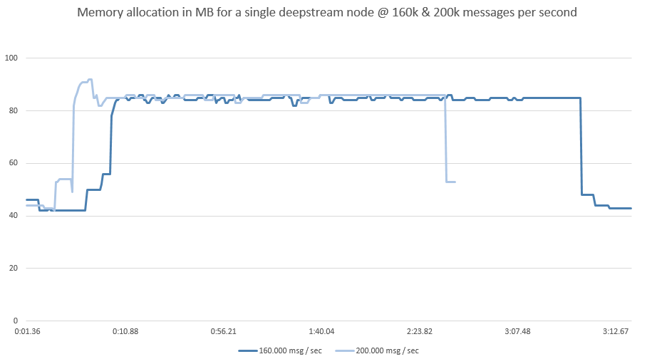

When it comes to benchmarking realtime systems, there are three core metrics to watch out for:

* **Latency:** How quickly can updates be passed through the system
* **Concurrency:** How many clients can be catered for simultaneously
* **Throughput:** How many updates can be send to clients in a given time

We’ve concentrated on latency and to some extend concurrency in [the last set of benchmarks](latency), but now it’s time to look into throughput.

## A real world test
It’s important to stress that our benchmarking approach aims to identify the best possible performance for real-world messages and cost-efficient infrastructures. We’ve found that it is possible to increase the following testresults by up to 400% by reducing messages to single character events and reserving dedicated, network optimized bare metal instances, but the use of these metrics would be of very debatable value.

### Test Setup
We ran two suites of tests, one for a single deepstream node, one for a cluster of six nodes. In both scenarios, a single provider pumped simulated foreign exchange rate updates into deepstream which were distributed across a number of connected test-clients.

We’ve open-sourced all aspects of our test-framework. If you’d like to run the tests yourself or benchmark your custom setup, please find them [here](https://github.com/deepstreamIO/ds-test-fx)

### Test Clients
We’ve developed a remote-controllable "probe" that can be used as both client and data-provider. Each probe is an independent process within a docker container that connects to a control deepstream-server upon startup and waits for further instructions.

Using deepstream's [listen](...) feature, the presence of the new probe is reported to a dashboard that allows to set the role of the process (client or provider), which deepstream server it connects to, how many updates it should send etc.

The dashboard is also responsible to receive  high level metrics from all probes. Lower level system metrics are aggregated on the individual machines using top.

Server Machines
Deepstream nodes are single-threaded processes with non-blocking I/O that scale via clustering. 
It is possible to utilize multi-core CPUs by running multiple deepstream nodes on the same machine - with the downside that nodes are subject to the limitations of that machine (ephemeral port limits, thread and memory allocation, single point of failure if the machine goes down etc.).

We'd rather recommend to spread the deepstream servers over multiple smaller machines, leading to higher fault tolerance, better resource utilisation and horizontal scalability. On AWS we found that EC2 t2.medium instances provide the best performance-to-cost ratio. We’d therefore used this instance type in our tests.

## Messages
Our test should be based on realistic message sizes, so we’ve simulated a foreign exchange price update with each message. An event with a name like fx/gbpusd (foreign exchange rate for pound vs dollar) sent a floating point number with a five digit precision, e.g. 1.34325. The number changed for every update, events where distributed over hundreds of different topics.
This results in an average message size of ~23bytes.

## Results - Single Node
Ok, let's start by exploring the limits of a single node. 

On a c4.2xlarge high CPU machine, an individual deepstream server can broadcast up to 400.000 events a second before the CPU struggles to keep up - but on an IaaS platform like AWS, this comes at a significant pricepoint. On a much more affordable t2.medium instance there's a sweetspot between 160.000-200.000 messages a second without exhausting the CPU.

At the bottom line this means that a billion messages on t2.medium come at 10 cents whereas the same amount on c4.2xlarge comes at 36 cent... making a cluster of t2.mediums both more affordable and...

But what about memory? Well, memory fortunately isn't too much of a concern. Deepstream is a stateless, transactional server that - when connected to an external cache - doesn't hold data itself... memory tends to level around 80MB per node

If the machines CPU is overutilized above 100% for a consecutive time however, garbage collection will be delayed and memory can add up. If this continuous for a prolonged amount of time, the server will run out of memory and eventually crash.
 
## Results - Cluster
Armed with these results, we've started looking at subjecting

0.1049382716    0.3638888889

## Results - Cluster

## Conclusion

t2.medium at $0.068 an hour
c4.2xlarge  8   31  15  Nur EBS $0.524 

