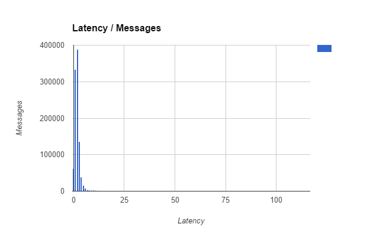
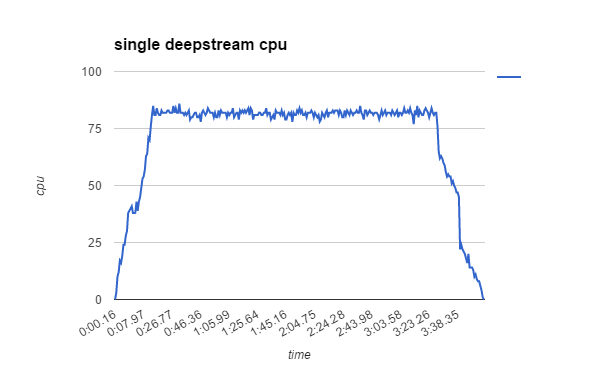
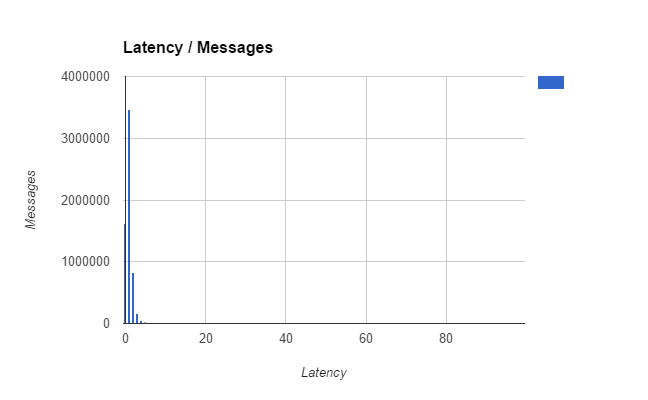
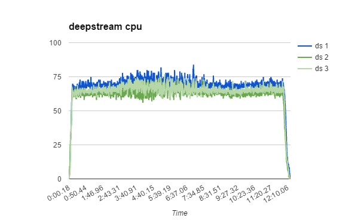

This test aims to verify horizontal scalability by establishing message latency and cpu consumption under high traffic for a single deepstream node in comparison to a cluster of three nodes.

### Test Setup
All tests were run on Amazon Web Services EC2 instances within the same region, running AWS Linux. For the cluster tests, Redis was used as a message bus.

<table class="mini">
    <thead>
        <tr>
            <th>&nbsp;</th>
            <th>Single Node</th>
            <th>Cluster</th>
    </thead>
    <tbody>
        <tr>
            <td>machine for deepstream servers</td>
            <td>1 EC2 c4.large</td>
            <td>1 EC2 c4.2xlarge</td>
        </tr>
        <tr>
            <td>deepstream servers</td>
            <td>1</td>
            <td>3</td>
        </tr>
        <tr>
            <td>client pairs</td>
            <td>250</td>
            <td>750</td>
        </tr>
        <tr>
            <td>ec2 t2.micro instances clients were distributed across</td>
            <td>2</td>
            <td>6</td>
        </tr>
        <tr>
            <td>message frequency per client</td>
            <td>~25ms</td>
            <td>~25ms</td>
        </tr>
        <tr>
            <td>duration of full load</td>
            <td>~3 min</td>
            <td>~12 min</td>
        </tr>
        <tr>
            <td>messages per second</td>
            <td>~10,000</td>
            <td>~30,000</td>
        </tr>
    </tbody>
</table>

## Single Deepstream Node

#### Latency Distribution
Average latency was 2.065ms ( machines being within same data centre )

#### CPU usage
CPU reached an average of 80% with approximately 10,000 messages a second

## Three deepstream node cluster

##### Latency Distribution
Average latency was 0.999ms ( machines being within same data centre )

#### CPU usage
CPU reached an average of 70% on all three processes to deal with approximately 30,000 messages a second

