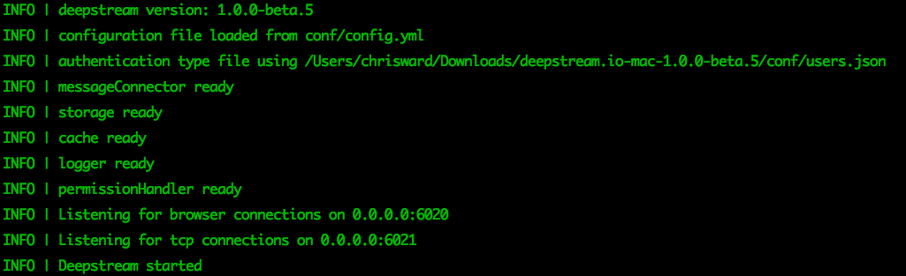
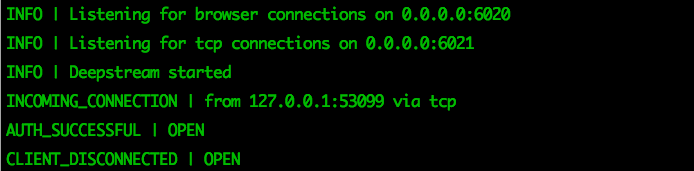
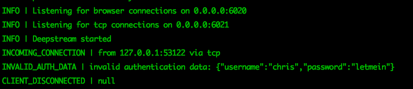

```
title: File based authentication
description: A deepstream authentication mechanism that reads credentials and userdata from a file
tags: [ authentication, file, hash, crypto]
```

File based authentication allows you to store usernames, passwords or password hashes and optional meta-data in a file that will be used to authenticate incoming connections.

Filebased authentication is a good choice for scenarios with smaller amounts of connections that need authenticating, e.g. publicly readable realtime dashboards with a small number of provider processes delivering the data.

## Using file based authentication

To enable authentication to a Deepstream server with user credentials stored in a local file, set the `type` key to `file` in the `auth` section of the server's [configuration file](/docs/server/configuration).

```yaml
auth:
  type: file
  options:
    path: ./users.json
    hash: 'md5'
    iterations: 100
    keyLength: 32
```

The `path` key contains a path to the file relative to the config file, that defines your users and passwords. By default this is the _users.yml_ file that comes with deepstream, but the name or location is up to you.

In the `hash` key add the hashing algorithm to hash the passwords, for example, using `md5` (or any other algorithm supported by your operating system). The `iterations` key sets how many times the algorithm should was applied to the user's password, and `keyLength` the length of the key generated. These should match how you hashed the passwords.

In the _users_ file, create a list of your users, their hashed passwords (you can create hashes with your setting using deepstreams [hash command](TODO)), and any other user data that you would like to pass to permissioning about that user.

```yaml
chris:
  password: tsA+ks76hGGSGHF8**/JHGusy78=75KQ2Mzm
  data:
    department: admin

fred:
  password: jhdGHJ7&0-9)GGSGHF8**/JHGusy78sjHJ&78
  data:
    department: finance
```

Start the Deepstream server and you should see the authentication type confirmed.



In your application code you can now connect to the Deepstream server and try to login a user.

```javascript
var deepstream = require( 'deepstream.io-client-js' );
var ds = deepstream( 'localhost:6021' );

ds.login({
    username: 'chris',
    password: 'password' // NEEDS TO BE REAL
}, function( success, errorCode, data ){
  ...
});
```

If a success, the Deepstream console will show:



And if a failure:



You can then handle the outcome of the login request in your JavaScript code, for example:

```javascript
ds.login({
    username: 'chris',
    password: 'password' // NEEDS TO BE REAL
}, function( success, data ){
    if (success === true) {
      // Handle a successful login
    } else {
      // Handle an incorrect login, the errorCode is available
      console.log(errorCode)
    }
});
```
