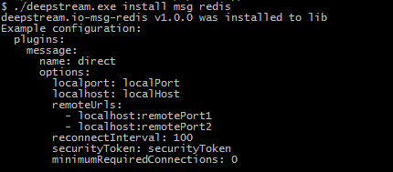

Deepstream nodes can scale horizontally by syncing their state via a messaging layer. This can be done with almost with any message-broker. Deepstream offers plugins for a number of popular systems and protocols, e.g. [AMQP](../integrations/msg-rabbitmq), [Apache Kafka](../integrations/msg-kafka) or [Redis Pub/Sub](../integrations/redis)

## Connecting deepstream nodes directly
For smaller clusters it used to be possible to connect deepstream nodes directly in a full-mesh configuration (everyone-to-everyone). This feature has been deprecated in its current incarnation, but will soon be replaced by a more scalable (and hopefully slightly smarter) direct-message-connector plugin based on the [Small World Network Paradigm](https://en.wikipedia.org/wiki/Small-world_network).

## Choosing a messaging system
Deepstream nodes use a simple publish/subscribe pattern with high-level topics to communicate with each other. Especially when used in conjunction with a cache this eliminates the need for persistent messaging or complex routing algorithms.
Since state is kept within the persistence layer, deepstream nodes can even life without guaranteed message delivery as subsequent messages will reconcile inconsistent states.

This means that deepstream only utilises the most common subset of messaging functionality. When it comes to choosing a message broker therefor, the main criteria should be speed, scalability and ease of use.

Let's look at what that means for some popular choices to be used together with deepstream. For a detailed analysis of the performance characteristics of various message brokers, have a look [at this comprehensive article](http://bravenewgeek.com/tag/kafka/).

#### Redis
Redis is a great fit for deepstream as it offers both caching (even disk persistence) and pub-sub capabilities. It's fast, simple and has all the features deepstream needs for production deployments.

#### AMQP
The "Advanced Message Queueing Protocol" is implemented by a large number of brokers, e.g. [RabbitMQ](https://www.rabbitmq.com/), [Qpid](https://qpid.apache.org/), [HornetQ](http://hornetq.jboss.org/) or [ActiveMQ](http://activemq.apache.org/) to name just a few. AMQP supports powerful routing patterns and achieves high reliability through features such as persistent queues or guaranteed message delivery, but is quite heavy and doesn't exactly excel when it comes to speed.

#### Kafka
Originally developed to power messaging at LinkedIn, Kafka has been open sourced by the Apache Foundation and has since found its way into many large enterprises. It offers queued, persistent and distributed pub/sub messaging that can be scaled to almost biblical dimensions. While faster than AMQP it still needs to save every message to disk, resulting in higher latency and can also be quite a hassle to set up and run.

## Messaging on Cloud Platforms
If you're running deepstream on a PaaS infrastructure it will make sense to interface with its messaging capabilities.

For __Amazon Webservices__, don't bother with SQS, SNS, Kinesis or SWF. Simply launch a small to medium sized [Elasticache](https://aws.amazon.com/elasticache/) instance with Redis as a caching engine and use its pub/sub capabilities (without being charged for message throughput).

__Google Cloud Platform__ offers a [build-in pub/sub service](https://cloud.google.com/pubsub/). It scales perfectly and is highly reliable, but not too fast and produces a bit of overhead by persisting messages and requiring ACKs. If your application requires low-latency messaging or only operates a small-to-medium sized deepstream cluster, running a Redis-instance on Google's [Compute Engine](https://cloud.google.com/compute/) or [Container Engine](https://cloud.google.com/container-engine/) might be a better choice.

__Microsoft Azure__ offers an AMQP based service bus, but it's quite slow and takes a lot of adjustments to get to work as the backbone of a pub/sub architecture. Similar to AWS it is a lot easier to just use Azure's [hosted Redis offering](https://azure.microsoft.com/en-us/services/cache/) instead.

#### Hosters / Messaging as a service providers
There is also a large offering of messaging-as-a-service offerings. [CloudAMQP](https://www.cloudamqp.com/), [CloudKafka](http://www.cloudkafka.com/), [StormMQ](http://stormmq.com/) or [RedisLabs](https://redislabs.com/) to name just a few. Whilst they offer great peace of mind through their managed services and high uptime guarantees, we strongly recommend to go with a message-broker running within your own data-center instead. Deepstream uses its message-bus extensively and every millisecond network latency between it and your cluster will make your application notably slower.

## Connecting to a message broker
Deepstream connectors are available for a number of message brokers and we're constantly looking to expand this selection. You can find an overview of available connectors on the [download page](/download). Connectors can be installed via deepstream's commandline interface, using the `msg` keyword, e.g.

```bash
deepstream install msg redis
deepstream install msg amqp
deepstream install msg kafka

# or on windows using deepstream.exe
deepstream.exe install msg redis
```

Each connector requires specific configuration parameters. These can be configured in deepstream's config.yml file (found either in your deepstream's `conf` directory or on linux in `/etc/deepstream/`). When installing a connector, it usually prints an example of the most common settings.



Message connectors are configured in the config's `plugins - message` section.

If you're using deepstream from Node, it's also possible to download connectors from NPM. All connectors follow the naming convention `deepstream.io-type-name`, e.g. `deepstream.io-msg-redis`.

## Writing your own connector
If you can't find a connector for your system of choice, you can also write your own quite easily in C++ with Node bindings or in NodeJS. If you're happy with the way your connector turned out, please consider contributing it. To do so, have a look at deepstream's [contribution guidelines](/info/community/contribution-guidelines)

To get started, just clone or fork the [msg-connector-template](//github.com/deepstreamIO/deepstream.io-msg-connector-template) and fill in the blanks. To see if it works, update the `settings` variable on line 9 of the [test file](https://github.com/deepstreamIO/deepstream.io-msg-connector-template/blob/master/test/message-connector-messagingSpec.js) and run the tests with `npm test`. Please note: The tests are very high level and only cover basic functionality. It will make sense to add additional tests that are specific to your connector.

#### Some considerations when implementing a message connector

**initialisation**
If your connector requires an initialisation step, e.g. establishing a connection to the messaging, its `isReady` property should initially be set to `false`. Once the connection is established, set `isReady` to `true` and emit a `ready` event by calling `this.emit( 'ready' );`.

**general errors**
Whenever a generic error occurs (e.g. a connectivity error or any other error that's not directly related to a `publish`, `subscribe` or `unsubscribe` operation, your connector should emit an `error` event and send the error message as a parameter, e.g. `this.emit( 'error', 'connection lost' );`

**operation-specific errors**
Whenever an error occurs as a consequence of a `publish`, `subscribe` or `unsubscribe` operation, pass it to the callback as the first argument, otherwise pass `null`.

**topics are very coarse by default**
A lot of message brokers take a long time to create new topics, but are very quick at sending messages.
Deepstream therefor only uses four high level topics (RECORD, RPC, EVENT plus a private topic), but will send and receive large numbers of messages on each of them. If this leads to performance problems it might make sense for the message connector to do some custom sub-routing, e.g. based on record namespaces etc.

**serialisation/deserialisation**
Messages are passed to the `publish()` method as javascript objects and are expected to be returned by the receiver as such. So it's up to the message connector to serialize and deserialize them, e.g. as JSON or MsgPack

**make sure not to receive your own messages**
The message connector acts as both publisher and subscriber for each topic. It should however not receive its own messages. Some messaging middleware supports this, but for others it might be necessary to add an unique sender-id to outgoing messages and filter out incoming messages that have the same id

**and finally**
Messaging is the backbone of deepstream's scaling / clustering capabilites. So this needs to be reliable... and fast!
