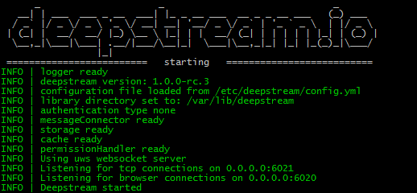

Deepstream can be installed via linux package managers and is available as a standalone executable for Windows and Mac.

## Installing on Linux
Deepstream is available in the APT and YUM package managers, so works on any Linux distribution that supports those.

#### via APT on Debian & Ubuntu
```bash
source /etc/lsb-release && echo "deb http://dl.bintray.com/deepstreamio/deb $DISTRIB_CODENAME main" | sudo tee -a /etc/apt/sources.list
sudo apt-key adv --keyserver hkp://keyserver.ubuntu.com:80 --recv-keys 379CE192D401AB61
sudo apt-get update
sudo apt-get install -y deepstream.io
```

#### via YUM on CentOS & AWS Linux

Add the Deepstream repository to your repositories file, and install Deepstream (_run as sudo_):

```bash
sudo wget https://bintray.com/deepstreamio/rpm/rpm -O /etc/yum.repos.d/bintray-deepstreamio-rpm.repo
sudo yum install -y deepstream.io
```

#### starting deepstream
```bash
deepstream start
```



#### configuring deepstream
You can either change deepstream's [configuration file](../../docs/server/configuration) directly in `/etc/deepstream` or create a copy and run deepstream with the `-c` flag. (Important, make sure to update all relative paths within the configuration after copying it).

```bash
$ cd ~
$ cp /etc/deepstream/* .
$ ls
config.yml  permissions.yml  users.yml
$ deepstream start -c config.yml
```

## Installing on Mac
[Download](TODO) the zip file, unzip and start the server:

```bash
cd ~/Downloads/deepstream.io-mac/
untar -xvf deepstream.io-mac
cd deepstream.io-mac
./deepstream.io-mac/deepstream start
```

## Installing on Windows
[Download](#) the zip file, unzip and start the server by _double clicking_ the executable file or running `deepstream.exe start` in `CMD`:


## Configuring deepstream on Mac & Windows
You can change deepstream's configuration files in the `conf` directory.