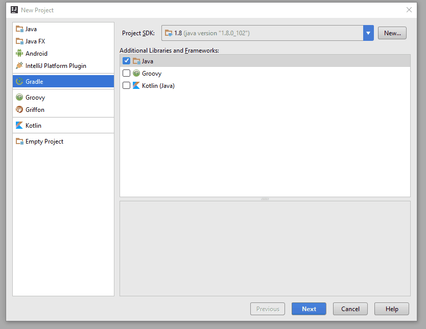

Time to get started with deepstream. This tutorial takes you through the initial steps of starting a server and connecting to it a simple application using the Java Client.

## Start the server

Let's start by installing the server. Just pick the [right version for your operating system](/install/) and follow its steps. Once the server is installed, you can start it with:

```bash
deepstream start
```

## Before we start

For this tutorial we'll be using the infamous gradle as our dependency manager. You have the option of using any other build system such as Ivy, Maven, Ant or that can interact with jCenter.

I'll also be using [intelliJ Community Edition](https://www.jetbrains.com/idea/) to create the project, but purely based on gradle configuration and no custom features.

## Setting up a project

First thing we want to do is create a gradle project



## Installing deepstream client

Installing deepstream is as simple as adding the following to your `gradle.build` file:

```
repositories {
    jcenter()
}

dependencies {
    compile 'io.deepstream:deepstream.io-client-java:0.8'
}
```

And now you can use deepstream! ( Remember to resync your gradle project for it to pick up any changes ).

## Using deepstream

The first thing we want to do is connect to a deepstream server. This can be done by:

```java
DeepstreamClient client = new DeepstreamClient( 'localhost:6021' );
```

Before you can start communicating with the server, you first need to login.

```java
LoginResult result = ds.login();
if( result.loggedIn() ) {
    System.out.println( "Log in success!" );
}
```

Now we can start using deepstreams API's for data-sync, events and rpcs.

#### Records

Let's first look at getting a record and setting it's data:

```java
Record record = ds.record.getRecord( "weather/berlin" );
```

You can set its a specific part of it's data using json paths:

```java
record.set( "temperature", 22 );
```

If you would like to know whenever the temperature changes you can subscribe to record changes:

```java
record.subscribe("temperature", new RecordPathChangedCallback() {
    @Override
    public void onRecordPathChanged(String recordName, String path, JsonElement data ) {
        System.out.println( "The temperature in berlin is: " +  data.getAsString() );
    }
});
```
#### Events

Next up, we deal with events. Events are a fire and forget mechanism, similar to the listener pattern
we use often today.

To emit an event, all you need is:

```java
client.event.emit( 'app' );
```

And to subscribe:

```java
ds.event.subscribe( "app", new EventListener() {
  @Override
  public void onEvent(String eventName, Object... objects) {
    System.out.println( "Event " + eventName + " has occured!" );
  }
});
```

#### RPCs

And finally, we have RPCs. The remote procedure calls can either be requested or provided

To make a remote procedure call:

```java
RpcResult rpcResult = ds.rpc.make("multiplyByTwo", 2 );
if( rpcResult.success() ) {
  System.out.println( "Result is: " + rpcResult.getData() );
} else {
  System.err.println( "Error attempting to multiplyByTwo" );
}
```

And to provide it:

```java
ds.rpc.provide("multiplyByTwo", new RpcRequestedListener() {
    @Override
    public void onRPCRequested(String rpcName, Object data, RpcResponse rpcResponse) {
        rpcResponse.send( (Integer) data * 2 );
    }
});
```

And that's it. There's of course a lot more to deepstream than that. If you'd like to learn more about records and what they can be used for, head over to the [record tutorial](/tutorials/core/datasync-records/).
