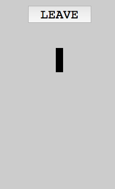

This tutorial will explain how you can simply turn an existing client browser game
into a realtime multiplayer game in x lines using deepstream.io, and turn your phone
into a WII like remote in the process.

## Choosing a game

There is a nice pong implementation for the browser on [https://github.com/jakesgordon/javascript-pong](https://github.com/jakesgordon/javascript-pong).
It's implemented as a tutorial with 5 parts.
The multiplayer mode is limited to a shared keyboard.


Let's improve the game with these features:

1. allow people to play the game using their mobile device
2. allow to control (start and stop) the game from the device
3. allow to play on touch devices

There exists a fork of this game which contains a refactoring with a more npm styled
code base. The directory structure was changed as well, the tutorial _parts_ were removed towards a common project setup.

This tutorial is based on that fork: [gburnett/javascript-pong](https://github.com/gburnett/javascript-pong)

## Game architecture

By keeping all the original logic in the browser, we can reuse it as our game server, allowing it to keep track of the score and game status.

A player needs to open another page which contains only some control for its pong paddle. This page acts
like a gamepad.

The players' data (control input and status) is synced in realtime between the pages via deepstream.

## Main page

To allow the players to join the game with their own device it's a common practice to let them
join via a QR code. The QR code will contain a URL to a seperate page containing each paddles
controller, and beneath it we'll place the player's status.

So let's adapt the sidebar and duplicate it for both players:

__index.html__

```html
<div class="sidebar sidebar-right">
  <h2>Player 2</h2>
  <a target="_blank" href="/controls.html#2">
    <div class="qrcode" id="qrcode2"></div>
  </a>
  <div class="online online-2">online</div>
</div>
<div class="sidebar">
  <h2>Player 1</h2>
  <a target="_blank" href="/controls.html#1">
    <div class="qrcode" id="qrcode1"></div>
  </a>
  <div class="online online-1">online</div>
</div>
```

To create the QR code we'll use the npm module `qrcodejs2` which can generate the code
in the browser.

__src/bootstrap.js__

```javascript
const options = {
  width: 128,
  height: 128,
  colorDark : "#000000",
  colorLight : "#ffffff",
  correctLevel : QRCode.CorrectLevel.H
}
new QRCode(document.getElementById("qrcode1"), Object.assign({
  text: window.location.origin + '/controls.html#1'
}, options))
new QRCode(document.getElementById("qrcode2"), Object.assign({
  text: window.location.origin + '/controls.html#2'
}, options))
```


## Controller page

__controls.html__

```html
<!DOCTYPE html>
<html>
  <head>
    <title>pong controller</title>
    <meta http-equiv="Content-Type" content="text/html; charset=utf-8"/>
    <meta name="viewport" content="width=device-width, user-scalable=no">
    <link href="style/controls.css" media="screen, print" rel="stylesheet" type="text/css" />
  </head>
  <body>
    <div class="gamepad-container">
      <button class="gamepad gamepad-down">↓</button>
      <button class="gamepad gamepad-up">↑</button>
    </div>
    <script src="node_modules/deepstream.io-client-js/dist/deepstream.js"></script>
    <script src="src/controls/index.js" type="text/javascript"></script>
  </body>
</html>
```

When the controller page is loaded the browser connects to the deepstream server and initializes
a player (record)[https://deepstream.io/docs/client-js/datasync-record/]. The record contains
the player name (for simplicity they are just named to `1` and `2`) and a property
which indicates if the player is pressing a button (`'up'` or `'down'`) or if the button is
not pressed (`null`).

__src/controller/index.js__

```javascript
const deepstream = window.deepstream
const player = window.location.hash.substr(1) || 1

// ignore authentication in this tutorial
const ds = deepstream('localhost:6020').login({}, function() {
  if (success) {
    return new Gamepad()
  }
})
```

The _Gamepad_ class registers event listener for both touch devices and mouse devices.

__src/controller/index.js__

```javascript
class Gamepad {
  constructor() {
    const buttons = document.querySelectorAll('.gamepad')
    this.initializeRecords('player/' + player)
    // up
    this.addEventListener(buttons[0], ['touchstart', 'mousedown'], this.onButtonPress)
    this.addEventListener(buttons[0], ['mouseup', 'touchend'], this.onButtonRelease)
    // down
    this.addEventListener(buttons[1], ['touchstart', 'mousedown'], this.onButtonPress)
    this.addEventListener(buttons[1], ['mouseup', 'touchend'], this.onButtonRelease)
  }

  addEventListener(element, types, handler) {
    element.addEventListener(type, handler.bind(this))
    for (let i=0; i<types.length; i++) {
      element.addEventListener(types[i], handler.bind(this))
    }
  }

  initializeRecords(playerRecordName) {
    this.record = ds.record.getRecord(playerRecordName)
    this.record.set({
      name: player,
      direction: null
    })
  }

  onButtonPress(event) {
    event.preventDefault()
    const target = event.target
    const up = target.classList.contains('gamepad-up')
    const down = target.classList.contains('gamepad-down')
    let direction
    if (up) {
      direction = 'up'
    } else if (down) {
      direction = 'down'
    } else {
      direction = null
    }
    this.updateDirection(direction)
  }

  updateDirection(direction) {
    this.record.set('direction', direction)
  }

  onButtonRelease() {
    this.record.set('direction', null)
  }
}
```


## Subscribe to record changes

Let's add some code to subscribe to the records changes on the main
page in order to update the paddle.

First we need to connect to the deepstream server like we did on
the controller page:

__src/game.js__

```javascript
const deepstream = require('deepstream.io-client-js')
const dsClient = deepstream('localhost:6020').login({})
```

Add the record subscriptions to the `Runner.addEvents` function

__src/game.js__

```javascript
addEvents: function() {
  Game.addEvent(document, 'keydown', this.onkeydown.bind(this))
  Game.addEvent(document, 'keyup',   this.onkeyup.bind(this))

  const player1 = dsClient.record.getRecord('player/1')
  const player2 = dsClient.record.getRecord('player/2')
  player1.subscribe(data => {
    this.game.updatePlayer(1, data)
  })
  player2.subscribe(data => {
    this.game.updatePlayer(2, data)
  })
},
```

Then add these two functions to the `Pong` object:

__src/pong.js__

```javascript
  updatePlayer: function(player, data) {
    if (player == 1) {
      this.updatePaddle(this.leftPaddle, data)
    } else if (player == 2) {
      this.updatePaddle(this.rightPaddle, data)
    }
  },

  updatePaddle: function(paddle, data) {
  	const direction = data.direction
    if (!paddle.auto) {
      if (direction === 'up') {
        paddle.moveUp();
      } else if (direction === 'down') {
        paddle.moveDown();
      } else if (direction === null) {
        paddle.stopMovingUp()
        paddle.stopMovingDown()
      }
    }
  },
```

That's it! Now we converted the game into a realtime multiplayer game.

## Wait, how can I play it?

You need to [install deepstream](https://deepstream.io/install/) and run the server.
For this tutorial you don't need any special configuration, so just start the server.

To bundle the JavaScript and run a HTTP server you can use the npm start script:

```shell
# ensure that deepstream server is running
npm start
```

## How can I join the game from another device?

Since we used `localhost` to connect to the deepstream server the game would
only work on the same machine, in other words: We can open the controls page in
another browser but not on the smartphone or another computer.


We need to change the deepstream host in _src/controls/index.js_ to this:

```javascript
const DEEPSTREAM_HOST = window.location.hostname + ':6020'
const ds = deepstream(DEEPSTREAM_HOST).login({}, function(success) {
  //...
})
```

If you want to play in your WiFi network you need to find out your WiFi IP address
and replace `localhost` with your IP in the browser of the main page to something like this:

```
http://192.168.1.10:9966
```

## Starting and stopping the game


To improve the UX we add another record which contains the current status
of the game, like if there is a winner and which players are currently online.

With that information the players can start and stop the game.

Let's add a join/leave button to the controler page:

__controls.html__

```html
<button class="join-leave">join</button>
```

And add handlers to the _Gamepad_ class to toggle the state between online and offline.
We use another record (status) with a property for each player: `player1-online` and `player2-online`.

__src/controls/index.js__

```javascript
class Gamepad {
  constructor() {
  	//...
    this.joinButton = document.querySelector('.join-leave')
    this.addEventListener(this.joinButton, ['click'], this.startStopGameHandler)
  }

  initializeRecords(playerRecordName) {
    //...
    const statusRecord = ds.record.getRecord('status')
    statusRecord.subscribe(`player${player}-online`, online => {
      if (online === true) {
        document.body.style.background ='#ccc'
        this.joinButton.textContent = 'leave'
      } else {
        document.body.style.background ='white'
        this.joinButton.textContent = 'join'
      }
    }, true)
  }

  startStopGameHandler(e) {
    ds.record.getRecord('status').whenReady(statusRecord => {
      const oldValue = statusRecord.get(`player${player}-online`)
      statusRecord.set(`player${player}-online`, !oldValue)
    })
  }
}
```

In the `Runner.addEvents` function we can now listen to the status record and toggle the
online indicator. To start the game both players need to join the game.

__src/game.js__

```javascript
const status = dsClient.record.getRecord('status')
status.subscribe('player1-online', online => {
  this.toggleChecked('.online-1', online)
  this.updateGameStatus(online, status.get('player2-online'))
})
status.subscribe('player2-online', online => {
  this.toggleChecked('.online-2', online)
  this.updateGameStatus(status.get('player1-online'), online)
})
```

and add a new function to the `Runner` object:

__src/game.js__

```javascript
updateGameStatus: function(player1, player2) {
  if (player1 && player2) {
    this.game.stop()
    this.game.startDoublePlayer()
  } else {
    this.game.stop()
  }
}
```

## Send feedback to the player

Let's give the user some feedback if you did a goal and if he wins a match.
The status record can be reused with another property: `player1-goals` and `player2-goals`.
We can trigger a function from the `Pong.goal` function:

__src/pong.js__

```javascript
//...
this.runner.notifyGoal(playerNo, this.scores[playerNo], lastGoal);
//...
```

and add the new function to the `Runner` object. We can also reset the
online status for the players if the game is over:

__src/game.js__

```javascript
notifyGoal: function(playerNo, goals, lastGoal) {
  const statusRecord = dsClient.record.getRecord('status')
  if (lastGoal) {
    statusRecord.set('player1-online', false)
    statusRecord.set('player2-online', false)
  }
  statusRecord.set(`player${playerNo+1}-goals`, {amount: goals, lastGoal: lastGoal})
},
```

Now we need to listen to the goals property in the _Gamepad_ class within the `initializeRecords` function:

__src/controls/index.js__

```javascript
//...
statusRecord.subscribe(`player${player}-goals`, data => {
  if ('vibrate' in navigator) {
    if (data.lastGoal) {
      navigator.vibrate([100, 300, 100, 300, 100])
    } else {
      navigator.vibrate(100)
    }
  }
})
```

## Use accelerometer to control the paddle



Using the buttons on a touch device feels some of sluggish. So let's improve it by using the
accelerometer instead. To simplify the code we replace all the code for the buttons in the controller.

We replace the buttons with an accelerometer indicator:

__controls.html__

```html
<div class="accelerometer-indicator"></div>
```

In the _Gamepad_ class we attach a handler for the [DeviceMotionEvent](https://developer.mozilla.org/en/docs/Web/API/DeviceMotionEvent) event. This event provides several properties, but we need just the
`accelerationIncludingGravity.y` value. The value range is from `-10` — `+10`.
To get a percentage we can use this formula:

```
vPercent = 1 - (vAbs/20) - (1/2)
```

__src/controls/index.js__

```javascript
  constructor() {
    //...
    this.indicator = document.querySelector('.accelerometer-indicator')
    if (window.DeviceMotionEvent != null) {
      window.addEventListener('devicemotion', this.listenOnMotion.bind(this))
    }
  }

  listenOnMotion(e) {
    const value = e.accelerationIncludingGravity.y
    const percentage = 1 - (value/20) - (1/2)
    const margin = Math.round(percentage * window.innerHeight - this.indicator.style.height)
    this.indicator.style['margin-top'] = margin + 'px'
    this.record.set('position', percentage)
  }
```

For the main page we need to adjust the condition within the `Pong.updatePaddle` function:

__src/pong.js__

```javascript
if (data.position != null) {
  this.setPaddlePosition(paddle, data.position)
} //...
```

and add the `setPaddlePosition` to the Pong object:

__src/pong.js__

```javascript
setPaddlePosition: function(paddle, percentage) {
  const height = defaults.height - defaults.paddleHeight - defaults.wallWidth
  const absolute = Math.round(percentage * height)
  paddle.setpos(paddle.x, absolute)
},
```

Finished!
Now we implemented all three features which are mentioned in the beginning of this tutorial.

## Footnotes

The tutorial is done but maybe you noticed that the game has some issues:

- **CSS**: where are the style sheets? - checkout the repo (see the link below)
- **UX**: it's hard to get the paddle to the borders with the accelerometer
- **UX**: the controls page should provide both accelerometer and buttons depending on the device
- **UX**: the paddle wobbles when using the accelerometer
- **Permissions**: a player can cheat by modifying the other players' paddle state (permissions)
- **Scalability**: the main page can only host one game at the same time
- **Deployment**: you can't set the deepstream host as an enivornment variable

All these issues are solved in this GitHub repo: [github.com/deepstreamIO/ds-demo-pong](https://github.com/deepstreamIO/ds-demo-pong)
