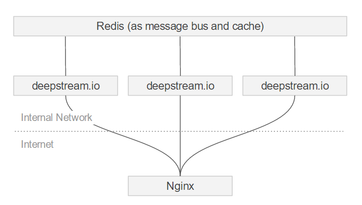

## What is nginx?
[Nginx](https://nginx.org/) (pronounced engine-x) is a multi purpose webserver. It's one of the most widely used HTTP servers and powers sites such as GitHub or reddit. Aside from serving static files via HTTP, it can be used as a reverse proxy, multi protocol load balancer or container for fast CGI scripts

## Using nginx and deepstream
Nginx can be used as a web-facing reverse proxy and load balancer in front of deepstream servers.



#### Reverse Proxy
For HTTP deployments it is common practice to not directly expose the webserver to the internet, but instead place a different server in front of it. For deepstream.io production deployments we highly recommend doing the same.
This "reverse proxy" handles tasks like SSL termination (decrypting incoming messages via HTTPS / WSS / TLS) and high availability / error reporting (e.g. replying to requests with a 500 status if the underlying server is unavailable).

#### Load Balancer
Deepstream can scale horizontally via clustering. If you want to provide a single URL for clients to connect to your cluster, you need to place something in front that distributes incoming connections between the available servers: a load balancer.
Load balancing persistent connections can be a bit tricky sometimes. Deepstream supports connections via TCP and via HTTP/WebSocket. Browser connections start as HTTP and are upgraded to WebSocket as soon as possible. The challenge here is to make sure that both the initial HTTP connection and the subsequent WebSocket connection by the same client are routed to the same server by the load balancer - a feature called "cross protocol sticky sessions". Nginx does a great job of solving this by associating sessions with a hash of the client's IP, as configured via `hash $remote_addr consistent;` in the `upstream` group (see example further down)

## Alternatives to nginx
Instead of nginx you could also use e.g. [HA Proxy](http://www.haproxy.org/) or [Apache](https://httpd.apache.org/)

#### What about AWS Elastic Load Balancer?
If you're deploying deepstream on AWS, you'd probably want to use Amazon's well integrated load balancing service ELB. At the time of writing (June 2016) ELB however lacks support for "sticky sessions during a protocol switch", a crucial feature that's required for deepstream (and libraries that help with bi-directional browser-connectivity, e.g. socket.io).
To learn more about this and how to deploy and load-balance a deepstream cluster on AWS, head over to the [AWS tutorial](../other-aws/)

## Installing nginx for use with deepstream
By default, Nginx comes with everything you need to use it as an HTTP server. To use it as a stream/TCP server though, you need to build it with its stream module enabled (`--with-stream`). On CentOS/AWS Linux this works as follows, for other Linux distributions, have a [look here](https://www.nginx.com/resources/admin-guide/installing-nginx-open-source/).

```bash
# install gcc (needed to compile nginx)
sudo yum update
sudo yum install gcc

# download and unzip nginx stable version (check for latest version number before using)
wget http://nginx.org/download/nginx-1.10.1.tar.gz
tar zxf nginx-1.10.1.tar.gz
cd nginx-1.10.1

# enable stream, disable unneeded http modules that require additional dependencies
./configure --with-stream --without-http_rewrite_module --without-http_gzip_module

# build and install
make
sudo make install
```

## Configuring nginx as a stream proxy / load balancer
The following configuration shows how to use nginx as a load balancer, SSL termination point and reverse proxy for HTTP, WS and TCP connections. If you only want to use parts of this functionality, remove the unneeded bits.

```bash
worker_processes  1;

error_log /usr/local/nginx/logs/error.log info;

events {
    worker_connections  1024;
}

stream {
    # define all http/ws endpoints
    upstream browserendpoint {
        hash $remote_addr consistent; #ensure sticky session between long-polling and ws
        server localhost:6022; #load balance connections between these two
        server localhost:6020; #add more as required
    }

    server {
        listen 6040 ssl; #external browser port
        proxy_pass browserendpoint;

        # SSL Termination, comment this section if you don't
        # want to use HTTPS/WSS (don't forget to remove the ssl after listen)
        ssl_certificate         /etc/ssl/certs/yourcert.crt;
        ssl_certificate_key     /etc/ssl/certs/yourkey.key;
        ssl_protocols           TLSv1 TLSv1.1 TLSv1.2;
        ssl_ciphers             HIGH:!aNULL:!MD5;
        ssl_session_cache       shared:SSL:20m;
        ssl_session_timeout     4h;
        ssl_handshake_timeout   30s;
    }

     # define all tcp endpoints
    upstream tcpendpoint {
        hash $remote_addr consistent;
        server localhost:6021; #load balance connections between these two
        server localhost:6023; #add more as required
    }

    server {
        listen 6041 ssl; #external tcp port
        proxy_pass tcpendpoint;

        # SSL Termination, comment this section if you don't
        # want to use HTTPS/WSS
        ssl_certificate         /etc/ssl/certs/yourcert.crt;
        ssl_certificate_key     /etc/ssl/certs/yourkey.key;
        ssl_protocols           TLSv1 TLSv1.1 TLSv1.2;
        ssl_ciphers             HIGH:!aNULL:!MD5;
        ssl_session_cache       shared:SSL:20m;
        ssl_session_timeout     4h;
        ssl_handshake_timeout   30s;
    }
}
```
